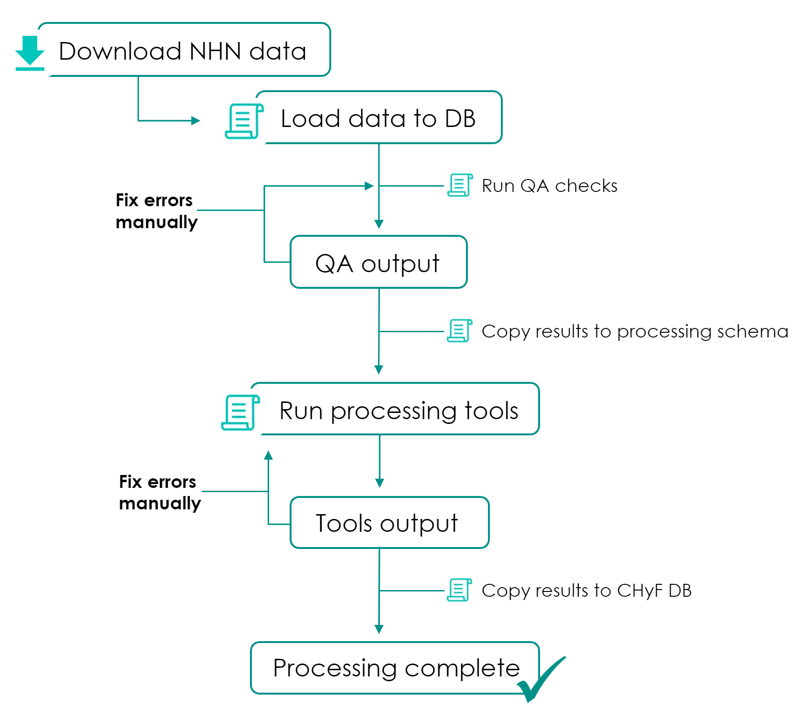
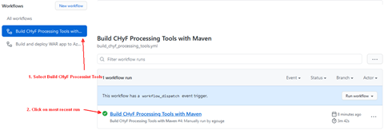
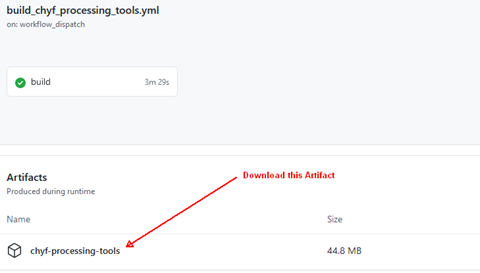

=====================
NHN - CHyF Conversion 
=====================

This document describes the steps and scripts required to convert data from NHN into the CHyF format.

Workflow Overview
-----------------

Processing Scripts
------------------

All python scripts referenced below are located in the github repo:

https://github.com/Canadian-Wildlife-Federation/CABD/tree/main/cabd-database/chyf/nhn_data_processing

The CHyF processing tools can be downloaded from github.  An action has been created to build the tools and store them as an artifact:

https://github.com/Canadian-Wildlife-Federation/CHYF/actions/workflows/build_chyf_processing_tools.yml

Click the most recent workflow run, then under Artifacts, download chyf-processing-tools.

Processing Steps
----------------

.. _step1download:

Step 1: Download Data
~~~~~~~~~~~~~~~~~~~~~

Download NHN datasets as filegeodatabase zip files (English):

https://ftp.maps.canada.ca/pub/nrcan_rncan/vector/geobase_nhn_rhn/gdb_en/

Step 2: Load Data
~~~~~~~~~~~~~~~~~

Python Script:
 ``nhn_data_load.py``

Usage:
 ``nhn_data_load.py <host> <port> <database> <user> <password> <nhnworkunit> <zipfile>``

Example:
 ``nhn_data_load.py localhost 5432 chyf postgres sql 07ha000 C:\temp\nhn_rhn_07ha000_gdb_en.zip``

Description:
 This script reads the data in the zip file, loads it into a schema named ``nhn<workunitid>`` (ex. ``nhn07ha000``), does some initial data processing and then runs the QA script automatically (step 3). Processing includes: snapping data to grid, mapping NHN attribute values to CHyF attribute values, creating and populating TerminalNodes layer.

 The initial population of the TerminalNodes table is based on the intersections of the hydro network and waterbodies with the work unit boundary layer. An attempt is made to populate the flow_direction attribute based on the NHN data, however any nodes for which flow_direction can’t be determined will need to be set manually (these are reported as a part of the QA script). Any additional terminal nodes will also need to be added manually.

Step 3: QA Data and Manually Fix Results
~~~~~~~~~~~~~~~~~~~~~~~~~~~~~~~~~~~~~~~~

.. note::
   The QA script is run by default as a part of the load process. 
   
   Once the initial output is reviewed and the returned errors are corrected the script should be run again to verify all issues were resolved.

Python Script: 
 ``nhn_data_qa.py``

Usage:
 ``nhn_data_qa.py <host> <port> <database> <user> <password> <nhnworkunit>``

Example:
 ``nhn_data_qa.py localhost 5432 chyf postgres sql 07ha000``

Description:
 The QA script creates a output table named ``nhn<workunitid>.qaerror`` (ex. ``nhn07ha000.qaerror``). This table contains all the details about the errors and warnings generated by the QA script.

.. csv-table:: 
    :file: tbl/qa_outputs.csv
    :widths: 30, 70
    :header-rows: 1

Errors are also logged to the console.

.. important::
   Not all errors have geometries. If reviewing the errors in a spatial program (QGIS), some errors may not be shown in the table. The results table should be queried directly or the QA script output should be reviewed to ensure all errors are resolved.

Resolving Errors:
 All data can be loaded into QGIS directly from the database and walk through the errors/warnings table, wditing features as nessessary.

Current QA Checks:
 * Flow_direction is populated for all terminal nodes.
 * No null or empty geometries.
 * All geometries are valid and simple.
 * No waterbodies represent island in another waterbody.
 * Waterbodies don’t overlap.
 * Flowpaths don’t overlap - I guess this could be valid if a pipe runs under/over a stream. 
 * No non-skeleton flowpaths inside waterbodies.
 * Degree 4 nodes.
 * Waterbody subtype of unknown and a name provided.
 * Waterbody intersects another waterbody of the same time with more than 3 vertices that are the same.

Step 4: Prepare data for Flowpath Tools
~~~~~~~~~~~~~~~~~~~~~~~~~~~~~~~~~~~~~~~
Python Script: 
 ``nhn_2_fpprocessing.py``

Usage:
 ``nhn_2_fpprocessing.py <host> <port> <database> <user> <password> <nhnworkunit>``

Example:
 ``nhn_2_fpprocessing.py localhost 5432 chyf postgres sql 07ha000``

Description:
 This copies the data from the ``nhn<workunitid>`` schema into the ``fpinput`` schema to be used as input to the flowpath processing tools. Drops all non-required data fields.

 The schema name ``fpinput`` is configured in the python script, so if you want to use another schema you can change this in the script. 

Optional:
 At this point you could drop the schema ``nhn<workunitid>`` as it is no longer required. However initially it might be useful to keep this data around until the entire process has been more thoroughly tested.

Step 5: Process Next Work Unit (Optional)
~~~~~~~~~~~~~~~~~~~~~~~~~~~~~~~~~~~~~~~~~
You can stop here and return to :ref:`Step 1 <step1download>` preparing the next work NHN work unit OR you can proceed to the next step to run the flowpath processing tools.

Multiple work units can be prepared and copied into the ``fpinput schema`` before running the flowpath tools.  In this case when you run the flowpath tools all prepared datasets will be processed.  

Step 6: Flowpath Processing Tools
~~~~~~~~~~~~~~~~~~~~~~~~~~~~~~~~~

Java Program:
 flowpath-constructor.bat (windows) or flowpath-constructor.sh (linux)

.. Note::
   Version 1.2.0 (or later) of the flowpath processing tools must be used.

Usage:
 ``flowpath-constructor.bat -d "host=host;port=port;db=database;user=username;password=password" inputschema outputschema``

 Complete details on running the tools can be found here: https://docs.google.com/document/d/1Fbz89ifYdQtq_FvaouM8co2CpO-R_JvlQ-3qaSe_HZw

Example:
 ``flowpath-constructor.bat -d "host=localhost;port=5432;db=chyf;user=postgres;password=sql" fpinput fpoutput``

Description:
 The flowpath processing tools read all the data for an aoi from the input schema, generate skeletons, directionalize and rank them and write the results to the output schema. Any error/warnings generated during this process are logged to the console and writing to the output schema errors table.
 The ``fpinput.aoi`` table is used to control the flowpath processing tools.

 .. csv-table:: 
     :file: tbl/fpinput_aoi.csv
     :widths: 30, 70
     :header-rows: 1

 The status column is used to control the processing of AOI’s by the flowpath processing tools. When run the tools finds the next AOI with a state of READY, updates that state to FP_PROCESSING, processes the data then once complete sets the state to FP_DONE (or error).  Multiple instances (on different computers) can run the flowpath processing tools at the same time and they will each process a different AOI (once an aoi is flagged as processing, no other instances will process the AOI).

 *Alternatively you can tell the flowpath processing tools to run a single aoi in which case it will ignore the status field and process the aoi.  We recommend not to use the tools this way as it may result in multiple users processing the same aoi. If you want to re-run an aoi manually update the status field to READY and (if needed) start the flowpath processing tools.*

Resolving Errors/Warnings:
 All errors generated during flowpath processing are written to the table ``<outputschema>.errors``.

 .. csv-table:: 
     :file: tbl/errors_warns.csv
     :widths: 30, 70
     :header-rows: 1

 You can query the table in query editor or view the results in a spatial viewer (QGIS). 

 A description of some of the common errors/warnings and how to deal with them is available here:
 https://docs.google.com/document/d/1R2KIUmYFV1kNvHjb39NQCCaKrBHIPVnYp6fG-sXAxKY

 If data needs fixing:

 #. Modify the features as required in the input schema (``fpinput``).
 #. Update the status field in the ``fpinput.aoi`` table to READY for the aoi you fixed.
 #. Restart flowpath processing tools.

Step 7: Review Results
~~~~~~~~~~~~~~~~~~~~~~

Review the flowpath processing results and ensure no issues need to be dealt with. This should include:

* Reviewing the status field in the ``fpoutput.aoi`` table to ensure all aois have a value of FP_DONE
* Reviewing the records of the ``fpoutput.errors`` table to ensure there are no items that need to be dealt with

Step 8: Catchment Processing
~~~~~~~~~~~~~~~~~~~~~~~~~~~~

*Skip this step as catchments are not being delineated at this time.*

Step 9: Convert Processing Results to the CHyF Model
~~~~~~~~~~~~~~~~~~~~~~~~~~~~~~~~~~~~~~~~~~~~~~~~~~~~

*Details to come...*