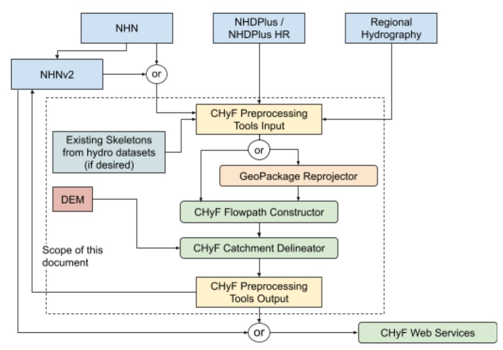
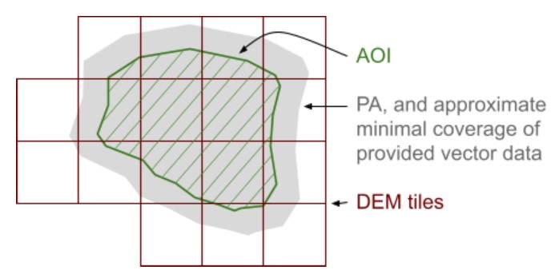
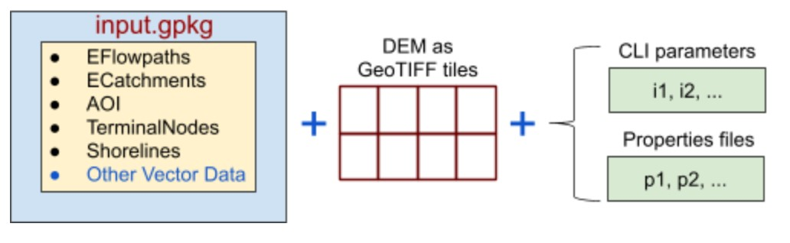

=============================================
Flowpath Constructor and Catchment Delineator
=============================================

History
-------

-----

+----------------+------------------------------------------------------------------------------------------------------------------------+
|Date            |Description                                                                                                             |
+================+========================================================================================================================+
|July 2021       |Updates to reflect modifications to software to allow reading and writing to PostGIS database (software version 1.2.0). |
+----------------+------------------------------------------------------------------------------------------------------------------------+
|March 31, 2020  |Initial Document Version on March 31, with minor updates on April 6.                                                    |
|April 06, 2020  |Created For:                                                                                                            |   
|                |Canada Centre for Mapping and Earth Observation,                                                                        |
|                |Centre canadien de cartographie et d’observation de la terre                                                            |
|                |Natural Resources Canada, Ressources naturelles Canada                                                                  |
+----------------+------------------------------------------------------------------------------------------------------------------------+

Copyright and Licence Notice
----------------------------

-----

Copyright © 2020 Government of Canada

Contains information licensed under the Open Government Licence – Canada.
(https://open.canada.ca/en/open-government-licence-canada)

Copyright © 2021 Canadian Wildlife Federation

Contributors
------------

-----

Canada Centre for Mapping and Earth Observation, Centre canadien de cartographie et d’observation de la terre Natural Resources Canada, Ressources naturelles Canada

    https://www.nrcan.gc.ca/home
    https://github.com/NRCan/chyf 

Canadian Wildlife Federation

    https://cwf-fcf.org/en/
    https://github.com/Canadian-Wildlife-Federation

Authorship
----------

-----

Mark Sondheim 

    Canada Centre for Mapping and Earth Observation, Natural Resources Canada
    (mark.sondheim@canada.ca) 

Emily Gouge, Chris Hodgson 

    Refractions Research, Inc.
    (egouge@refractions.net, chodgson@refractions.net)

Introduction
------------

-----

CHyF provides a series of preprocessing tools to simplify the use of CHyF services. The first two publicly available tools are the CHyF Flowpath Constructor and the CHyF Catchment Delineator.

Included in this document are the specifications for the input data for the tools as well as the output that they generate. It is assumed that the input data used for geoprocessing has already been converted to CHyF compliant hydrologic features, as defined by the input data schemas described here. Additional attributes may also be included; they will not be altered in any way.

Both tools have a command line interface that allows for various input parameters to be specified and both also make use of a properties file. The tools are designed to take advantage of a multi-threaded architecture, so significant speed increases are practical with the right computing environment. However, even on a suitable desktop computer, they are quite performant.

The software is open source under the Apache 2 license. It is written in Java SE 11 (Long Term Support). It can be run directly or by using Python scripts for example if desired.

Several screenshots showing inputs and outputs are shown in Appendix 4. Reviewing these first will give the reader a clear idea of what the software does.

Purpose
-------

-----

Currently, two preprocessing tools are available: the CHyF Flowpath Constructor and the CHyF Catchment Delineator. The intent of each is described below. 

CHyF Flowpath Constructor
~~~~~~~~~~~~~~~~~~~~~~~~~

* The Flowpath Constructor may be used to generate all elementary flowpaths found in polygonal waterbodies, such as lakes, estuaries and double-line (i.e. comparatively wide) rivers, or subdivisions of such waterbodies. It may for example be of interest to break large lakes or rivers into multiple subdivisions.

* In some situations existing skeletons in lakes are available that are considered worth retaining, in terms of both their geometry and associated attributes. In this case, the Flowpath Constructor can be run such that only bank flowpaths are generated. Where a bank flowpath intersects an existing skeleton flowpath, the existing skeleton flowpath is broken into two skeleton flowpaths, with identical attribution.

* In addition to the skeletonizer the Flowpath Constructor includes a directionalizer that can determine the direction of a flowpath if newly created or if the direction is unknown. 

* The tool can also assess whether a flowpath represents a primary or secondary flow; this is of particular interest in areas where the flowpaths do not all follow a dendritic pattern, i.e., at points of divergence. The resulting primary flowpaths do form a dendritic pattern. Any cycles in the network (where water can flow around a loop back to its starting position) are corrected where practical.

CHyF Catchment Delineator
~~~~~~~~~~~~~~~~~~~~~~~~~

* This tool is used to create CHyF compliant catchments from hydrographic data in combination with a gridded Digital Elevation Model that represents the elevation of the bare earth.

* It takes into account the surface hydrography and a digital elevation model representing the ground surface. In very flat areas where the elevation data may not be very helpful, the results approximate a medial axis approach, with each catchment boundary placed about halfway between the nearby linear or polygonal waterbodies. Where local elevation differences are more significant, the boundaries are located such that the slopes on either side are oriented toward different waterbodies. The software makes a natural and continuous progression between these cases. 

* CHyF compliant catchments delineated by the tool include reach catchments and bank catchments. Water catchments, which may for example correspond to lakes, wide streams, or estuaries - or subdivisions of such features - are provided by the user as input.

* The reach catchments, bank catchments and water catchments form a complete coverage of the Area of Interest.

* Empty catchments are out of scope with this version of the delineator. This means that depressions that do not contain linear or polygonal waterbodies and are not bordering such waterbodies will be absorbed into adjacent catchments. 

* Special treatment of built-up areas is also out of scope at this time. 

The tools are typically run sequentially with the Flowpath Constructor first, followed by the Catchment Delineator. In the material that follows, the discussion generally pertains to the two tools taken together, but clarity is provided where differences exist. 

High Level Workflow
~~~~~~~~~~~~~~~~~~~

The primary sources for input data are assumed to be the National Hydro Network (NHN) or in the future the NHNv2 in Canada and the National Hydrography Dataset Plus (NHDPlus) or NHDPlus HR in the United States. However, regional datasets could also be used. 

    *Figure 1: High level workflow*

The CHyF Preprocessing Tools input includes reach flowpaths and water catchments, and optionally skeleton flowpaths, all as described in detail later in this document. The figure shows the CHyF Flowpath Generator and the CHyF Catchment Delineator being used in sequence. This in fact is how they typically would be deployed, but using them independently of one another is also possible. 

Figure 1 also shows that the GeoPackage Reprojector (Appendix 3, section 1) can be applied optionally. This simple command line utility allows the user to reproject the data, and to set a coordinate precision if desired, without needing to run a GIS or making use of other complex tools. 

The CHyF Preprocessing Tools Output includes reach, bank and skeleton flowpaths, as well as reach, bank and water catchments. In the case of the NHN/NHNv2 these elements or a subset of them are copied into the NHNv2. The CHyF Preprocessing Tools Output can also be used as input to CHyF Web Services. 

Data Extents and Coordinates
----------------------------

-----

This section describes the extent of the data as related to one or more of the preprocessing applications. As it is assumed that both current applications will be run, it does not distinguish what is specific to each of them. Coordinate values of input and output data are also reviewed.

Data Extents
~~~~~~~~~~~~

The diagram below shows the various data extents. These include the Area of Interest (green boundary with diagonal lines), the Processing Area (gray), and a coverage of DEM tiles (boxes). Descriptions are found below. 

    *Figure 2: Data extent of AOI, Processing Area, and DEM*

Area of Interest (AOI) – provided by the user
+++++++++++++++++++++++++++++++++++++++++++++

This is the area of interest represented as a simple polygon without holes. Typically the AOI corresponds to a major drainage basin or a major component of it. If the AOI is not known with a high degree of accuracy beforehand, the tools will still work. Note that the AOI is also provided as an output, with adjusted boundaries as described later, and with all output flowpath and catchment data contained within this AOI.

Constraints

* If the AOI intersects polygonal waterbodies, such as lakes, estuaries or wide rivers, it must be correctly noded along the common boundary, i.e., the vertices must be identical along the sections of the respective boundaries where they touch. This means that the boundary of the AOI and the boundary of the contained water catchment are coincident along the path across the water. 

* Along the coast the AOI may extend into the ocean and thus may contain offshore islands. 

* The boundary of the AOI ideally does not cross any reach flowpaths; instead, it winds its way around the headwater streams that are within the AOI. If the AOI crosses such streams, or larger waterbodies, then all of such intersected features will be treated as within the AOI.

Processing Area (PA) – system generated
+++++++++++++++++++++++++++++++++++++++

The Processing Area (PA) is the term applied to an area larger than the AOI; it is system generated. The processing steps carried out by the CHyF preprocessing tools are applied to the PA to eliminate any boundary effects within the AOI. The user provides input data for an area larger than the AOI, as described later, but does not provide a PA polygon. If the user provides input data only up to the AOI boundary, then processing artifacts and omissions may occur along and near the AOI boundary.

Constraints

* The input vector data extends beyond the AOI boundary in all directions.

DEM
+++

The Digital Elevation Model data is provided by the user as a series of gridded GeoTIFF tiles.

Constraints

* GeoTIFF tiles must be provided that extend beyond the AOI. The tile coverage should extend at least to the PA boundary. That boundary is not given, but for practical purposes, it can be assumed to be about 5 km in all directions beyond the AOI, when the nominal scale of the input vector data is on the order of 1:20 000 to 1:25 000. (5 km is equal to one-half of the length of a side of the processing block, as described in section 4.5.)

* The grid spacing of the DEM should be approximately equal to (1/hscale) * 0.001, where hscale is the nominal data compilation scale of the hydrographic data, as represented by the original rivers and lakes data. For example, if the hydrographic data is considered to be at a scale of 1:20 000, then the grid spacing should be about 20 metres, although any spacing from roughly 10 m to 40 m should be acceptable. 2 m lidar derived DEM data should be resampled or decimated to create a 20 m grid. Higher resolution grids will require much longer processing times and the advantage of the higher density data is likely to be minimal, given the constraints imposed by the much coarser hydrography.

* The tiles must not overlap each other

Data Coordinates
~~~~~~~~~~~~~~~~

The work carried out by the preprocessing routines occurs in 2D space. However, the incoming data may be in 2D (x,y), 3D (x,y,z), or 3D (x,y,m). 

Input Data High Level Description
---------------------------------

-----

All vector data is provided as a single geopackage. The gridded elevation data is provided as a set of GeoTIFF tiles. The tools are each run through a Command Line Interface (CLI) that accepts a series of parameters. A properties file can be supplied to fine tune the processing carried out by each tool. If a properties file is not supplied, defaults will be used.

    *Figure 3: Input data, including a geopackage, geotiff tiles, and parameters*

Packaging for Input Vector Data
~~~~~~~~~~~~~~~~~~~~~~~~~~~~~~~

* All vector data will be provided as a single GeoPackage containing a series of spatial tables (layers) as described in the table below. All the tables are required to have their SRID (spatial reference identifier) values specified correctly and they should all be the same SRID.

.. csv-table::
    :file: tbl/flow_catch_tools/fc_inputvecdata.csv
    :widths: 20, 40, 40
    :header-rows: 1

* Other spatial tables (layers) may be present, but they are not processed in any way by either the Flowpath Generator or the Catchment Delineator.

Packaging for Input DEM Data
~~~~~~~~~~~~~~~~~~~~~~~~~~~~

All DEM data will be delivered as a series of GeoTIFF files residing in the same folder.

Projection for Input Data
~~~~~~~~~~~~~~~~~~~~~~~~~

* The user is responsible for providing the vector data in a suitable projection. A projection should be used that emphasizes the correct portrayal of shape, such as Lambert Conformal, although good results are also obtained with equal area projections.

* All vector layers provided must be in the same projection. All processing carried out by the CHyF Preprocessing Tools will be carried out in this projection.

* The DEM gridded data may be in the same projection as the vector data or in another projection. The projection information must be embedded in the GeoTIFF files. The GeoTIFF files may be in different projections, along an international border for example. In this case they must overlap to ensure that no gaps exist. The Catchment Delineator will make use of data in the overlap zone in an arbitrary manner, which should not matter if they were harmonized beforehand.

CLI Input Parameters and Properties Files
~~~~~~~~~~~~~~~~~~~~~~~~~~~~~~~~~~~~~~~~~

Descriptions of the CLI input parameters and the properties file used for each tool are provided in Appendices 1 and 2. These descriptions are located within their respective initial sections, both entitled Running the Software.

Reserved Words
~~~~~~~~~~~~~~

Reserved words are listed here, as related to the names of spatial tables in a geopackage and to the names of columns in a spatial table.

+------------------------------------------------------------------------------------------------------------------------------------------------------------------------+----------------+
|Restrictions                                                                                                                                                            |Words           |
+========================================================================================================================================================================+================+
|**Reserved words related to the names of spatial tables**                                                                                                                                |
+------------------------------------------------------------------------------------------------------------------------------------------------------------------------+----------------+
|These words can only refer to the spatial tables as defined in section 4.1. If tables with any of these names are used for other purposes, the names should be altered. |EFlowpaths      |
|                                                                                                                                                                        |ECatchments     |
|                                                                                                                                                                        |AOI             |
|                                                                                                                                                                        |TerminalNodes   |
|                                                                                                                                                                        |Shorelines      |
+------------------------------------------------------------------------------------------------------------------------------------------------------------------------+----------------+
|**Reserved words related to the names of columns in specific spatial tables**                                                                                                            |
+------------------------------------------------------------------------------------------------------------------------------------------------------------------------+----------------+
|EFlowpaths: within this table these column names must be used only as described in section 5.1.                                                                         |ef_type         |
|                                                                                                                                                                        |direction_known |
|                                                                                                                                                                        |name_string     |
|                                                                                                                                                                        |geometry        |
+------------------------------------------------------------------------------------------------------------------------------------------------------------------------+----------------+
|ECatchments: within this table these column names must be used only as described in section 5.2.                                                                        |ec_type         |
|                                                                                                                                                                        |name_string     |
|                                                                                                                                                                        |geometry        |
+------------------------------------------------------------------------------------------------------------------------------------------------------------------------+----------------+
|AOI: within this table this column name must be used only as described in section 5.3.                                                                                  |geometry        |
+------------------------------------------------------------------------------------------------------------------------------------------------------------------------+----------------+
|TerminalNodes: within this table these column names must be used only as described in section 5.4.                                                                      |flow_direction  |
|                                                                                                                                                                        |geometry        |
+------------------------------------------------------------------------------------------------------------------------------------------------------------------------+----------------+
|Shorelines: within this table this column name must be used only as described in section 5.5.                                                                           |geometry        |
+------------------------------------------------------------------------------------------------------------------------------------------------------------------------+----------------+

Input Data: Schemas
-------------------

-----

The names of all attributes (the names given under Column in the tables that follow) are case sensitive. The data must be provided with the correct column names.

Elementary Flowpaths
~~~~~~~~~~~~~~~~~~~~

* The elementary flowpaths must be provided with an attribute named ef_type. 

* All reach flowpaths must be included (ef_type=1). However, other types of elementary flowpaths may be provided, but they will not be used by the Catchment Delineator tool. Bank and optionally skeleton flowpaths are created by the Waterbody Skeletonizer tool.

* Other attributes include direction_known and name_string, as defined in the table below.

* The attribute rank is not provided on input, but it is on output. If it appears in the input data, the process defining rank will not run.

* Identifiers, names, length and other attributes may be given for each elementary flowpath provided, but they are not used by either of these tools. 

* The attribute name_string will not be populated for any generated flowpaths. However, it will be practical to do so by running a separate tool. This tool (not yet developed) will also populate Strahler Order, Horton Order, Hack Order and length.

+------------------------------------------------------------------------------------------------------------------------------------------------------------------------------------------------------------------------------------------------------------------------------------+
|**Feature: eflowpath (in spatial table: EFlowpaths)**                                                                                                                                                                                                                               |
|                                                                                                                                                                                                                                                                                    |
|Definition: an elementary flowpath conforming to the CHyF model                                                                                                                                                                                                                     |
|                                                                                                                                                                                                                                                                                    |
|Attributes: ef_type, direction_known, name_string                                                                                                                                                                                                                                   |
|                                                                                                                                                                                                                                                                                    |
|Geometry: linestring                                                                                                                                                                                                                                                                |
|                                                                                                                                                                                                                                                                                    |
|Constraints: The sequence of linestring vertices corresponds to the direction of flow if known.                                                                                                                                                                                     |
+------------------------------------------------------------------------------------------------------------------------------------------------------------------------------------------------------------------------------------------------------------------------------------+

+----------------+----------------------------------------------+----------+---------------------------------------------------------------------------------------------------------------------------------------------------------------------------------------------------------+
|Column          |Required                                      |Data Type |Description                                                                                                                                                                                              |
+================+==============================================+==========+=========================================================================================================================================================================================================+
|ef_type         |Yes                                           |Integer   |A code representing the type of elementary flowpath. (See the table below for valid values)                                                                                                              |
+----------------+----------------------------------------------+----------+---------------------------------------------------------------------------------------------------------------------------------------------------------------------------------------------------------+
|direction_known |No. If not supplied, a value of -1 is assumed.|Integer   |A code specifying  whether the direction of the vertices corresponds to the direction of the flow. (See the table below for valid values)                                                                |
+----------------+----------------------------------------------+----------+---------------------------------------------------------------------------------------------------------------------------------------------------------------------------------------------------------+
|name_string     |No                                            |String    |The name, or a reference to a name, of the linear or polygonal waterbody containing the flowpath. The type is a character string, which may be a UUID, some other identifier, or a natural language name.|
+----------------+----------------------------------------------+----------+---------------------------------------------------------------------------------------------------------------------------------------------------------------------------------------------------------+
|aoi_id          |No - Geopackage                               |UUID      |Link to AOI id.                                                                                                                                                                                          |
|                |Yes - PostGIS                                 |          |                                                                                                                                                                                                         |
+----------------+----------------------------------------------+----------+---------------------------------------------------------------------------------------------------------------------------------------------------------------------------------------------------------+
|other attributes|No                                            |n/a       |Other attributes may be given, but will be ignored by CHyF tools and services.                                                                                                                           |
+----------------+----------------------------------------------+----------+---------------------------------------------------------------------------------------------------------------------------------------------------------------------------------------------------------+
|geometry        |Yes                                           |LineString|Geometry representing  the flowpath, with the sequence of vertices corresponding to the flow direction (if known).                                                                                       |
+----------------+----------------------------------------------+----------+---------------------------------------------------------------------------------------------------------------------------------------------------------------------------------------------------------+

.. csv-table:: **ef_type**
    :file: tbl/flow_catch_tools/fc_ef_type.csv
    :widths: 5, 15, 80 
    :header-rows: 1

.. csv-table:: **direction_known**
    :file: tbl/flow_catch_tools/fc_directionknown.csv
    :widths: 5, 15, 80 
    :header-rows: 1

Elementary Catchments
~~~~~~~~~~~~~~~~~~~~~

* The elementary catchments must be provided with an attribute named ec_type. 

* All water catchments must be included (ec_type=4). No other catchment types are allowed as input.

* Identifiers, names, areas and other attributes may be given for each elementary catchment provided, but they are not used by either the Waterbody Skeletonizer or the Catchment Delineator.

+------------------------------------------------------------------------------------------------------------------------------------------------------------------------------------------------------------------------------------------------------------------------------------+
|**Feature: ecatchment (in spatial table: ECatchments)**                                                                                                                                                                                                                             |
|                                                                                                                                                                                                                                                                                    |
|Definition: an elementary catchment conforming to the CHyF model                                                                                                                                                                                                                    |
|                                                                                                                                                                                                                                                                                    |
|Attributes: ec_type, name_string                                                                                                                                                                                                                                                    |
|                                                                                                                                                                                                                                                                                    |
|Geometry: linestring                                                                                                                                                                                                                                                                |
|                                                                                                                                                                                                                                                                                    |
|Constraints: polygon (may contain holes; multipolygon is not allowed)                                                                                                                                                                                                               |
+------------------------------------------------------------------------------------------------------------------------------------------------------------------------------------------------------------------------------------------------------------------------------------+

+----------------+----------------------------------------------+----------+---------------------------------------------------------------------------------------------------------------------------------------------------------------------------------------------------------------------------------------------------------------------------+
|Column          |Required                                      |Data Type |Description                                                                                                                                                                                                                                                                |
+================+==============================================+==========+===========================================================================================================================================================================================================================================================================+
|ec_type         |Yes                                           |Integer   |A code representing the type of elementary catchment. (See the table below for valid values)                                                                                                                                                                               |
+----------------+----------------------------------------------+----------+---------------------------------------------------------------------------------------------------------------------------------------------------------------------------------------------------------------------------------------------------------------------------+
|name_string     |No                                            |String    |The name, or a reference to a name, of the polygonal waterbody from which a water catchment was derived. The type is a character string, which may be a UUID, some other identifier, or a natural language name.                                                           |
+----------------+----------------------------------------------+----------+---------------------------------------------------------------------------------------------------------------------------------------------------------------------------------------------------------------------------------------------------------------------------+
|aoi_id          |No - Geopackage                               |UUID      |Link to AOI id.                                                                                                                                                                                                                                                            |
|                |Yes - PostGIS                                 |          |                                                                                                                                                                                                                                                                           |
+----------------+----------------------------------------------+----------+---------------------------------------------------------------------------------------------------------------------------------------------------------------------------------------------------------------------------------------------------------------------------+
|other attributes|No                                            |n/a       |Other attributes may be given, but will be ignored by CHyF tools and services.                                                                                                                                                                                             |
+----------------+----------------------------------------------+----------+---------------------------------------------------------------------------------------------------------------------------------------------------------------------------------------------------------------------------------------------------------------------------+
|geometry        |Yes                                           |Polygon   |Geometry representing the area covered by a lake, an estuary, a double-line river, or a portion of any of these. A large lake may be subdivided into component pieces, each of which is treated as a water catchment. The same applies to estuaries and double-line rivers.|                                                                                       |
+----------------+----------------------------------------------+----------+---------------------------------------------------------------------------------------------------------------------------------------------------------------------------------------------------------------------------------------------------------------------------+

.. csv-table:: ec_type
    :file: tbl/flow_catch_tools/fc_ec_type.csv
    :widths: 5, 15, 80
    :header-rows: 1

Area Of Interest (AOI)
----------------------

-----

+------------------------------------------------------------------------------------------------------------------------------------------------------------------------------------------------------------------------------------------------------------------------------------+
|**Feature: aoi (in spatial table: AOI)**                                                                                                                                                                                                                                            |
|                                                                                                                                                                                                                                                                                    |
|Definition: The area of interest for which the respective preprocessing tools can be expected to provide accurate results                                                                                                                                                           |
|                                                                                                                                                                                                                                                                                    |
|Attributes: id                                                                                                                                                                                                                                                                      |
|                                                                                                                                                                                                                                                                                    |
|Geometry: polygon                                                                                                                                                                                                                                                                   |
|                                                                                                                                                                                                                                                                                    |
|Constraints: multi-polygon not supported; simple polygon without holes                                                                                                                                                                                                              |
+------------------------------------------------------------------------------------------------------------------------------------------------------------------------------------------------------------------------------------------------------------------------------------+

+----------------+----------------------------------------------+----------+---------------------------------------------------------------------------------------------------------------------------------------------------------------------------------------------------------------------------------------------------------------------------+
|Column          |Required                                      |Data Type |Description                                                                                                                                                                                                                                                                |
+================+==============================================+==========+===========================================================================================================================================================================================================================================================================+
|id              |No - Geopackages                              |UUID      |Unique identifier for AOI for linking features to AOI in PostGIS.                                                                                                                                                                                                          |
|                |Yes - PostGIS                                 |          |                                                                                                                                                                                                                                                                           |
+----------------+----------------------------------------------+----------+---------------------------------------------------------------------------------------------------------------------------------------------------------------------------------------------------------------------------------------------------------------------------+
|name            |No - Geopackages                              |String    |A user friendly unique identifier for the AOI.                                                                                                                                                                                                                             |
|                |Yes - optional, for PostGIS                   |          |                                                                                                                                                                                                                                                                           |
+----------------+----------------------------------------------+----------+---------------------------------------------------------------------------------------------------------------------------------------------------------------------------------------------------------------------------------------------------------------------------+
|status          |No - Geopackages                              |String    |Identifies the current processing state of the AOI. Valid values include: READY, FP_PROCESSING, FP_DONE, WS_PROCESSING, WS_DONE, FP_ERROR, WS_ERROR                                                                                                                        |
|                |Yes - optional, for PostGIS                   |          |                                                                                                                                                                                                                                                                           |
+----------------+----------------------------------------------+----------+---------------------------------------------------------------------------------------------------------------------------------------------------------------------------------------------------------------------------------------------------------------------------+
|geometry        |Yes                                           |Polygon   |This user supplied polygon defines the area of interest.                                                                                                                                                                                                                   |                                                                                       |
+----------------+----------------------------------------------+----------+---------------------------------------------------------------------------------------------------------------------------------------------------------------------------------------------------------------------------------------------------------------------------+
