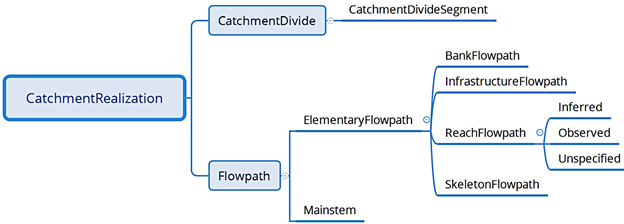

=============
Logical Model
=============

-----

Abstract
--------
The Open Geospatial Consortium has defined “OGC® WaterML 2: Part 3 - Surface Hydrology 
Features (HY_Features) - Conceptual Model”, but not any particular implementation of it. The Common Hydrology Features (CHyF) model extends HY_Features and makes some minor changes to it required for implementation and the delivery of high performance services. HY_Features discusses catchment coverage and topological relations. In CHyF these are key ideas, as is the notion that hydrologically defined network components form elements of a mathematical graph, allowing for very fast network traversal. 

HY_Features defines catchments and catchment networks, as well as rivers, channels, flowpaths and hydrographic networks. The CHyF logical model specifies a profile and some extensions to HY_Features, as required to implement topological and graph relations. This starts with the definition of elementary catchments and elementary flowpaths, which are treated as fundamental elements. They are tightly specified terms corresponding to basic catchments and flowpaths in HY_Features and the basic components in the standard reach-catchment model (Maidment and Clark, 2016). If they are subdivided, the result is simply more elementary catchments and elementary flowpaths. Consequently, they are the building blocks used to form complementary coverages as well as a graph structure referred to as a hygraph. Building the hygraph necessitates that connections between features be manifest through their geometry. Divergences and distributaries are supported in CHyF, as the hygraph need not be hierarchical. Nevertheless, CHyF does recognize hierarchical drainage basins and the value in identifying them explicitly (Blodgett, et al, 2021). 

Different kinds of elementary catchments and elementary flowpaths are defined in CHyF. Of note is that polygonal waterbody features, or portions of such features, are treated as elementary catchments in their own right. In addition to these water catchments, several kinds of land-based elementary catchments are recognized. These model constructs are compatible with the higher level conceptual model in HY_Features, although they differ in detail from other popular implementation models. With the approach taken it becomes practical to handle very large lakes and rivers, as well as coastal ocean zones. CHyF also includes wetlands, glaciers and snowfields as kinds of hydro features; these features help complete the concept of a catchment coverage as put forward by HY_Features. 

-----

Keywords
--------
The following are keywords to be used by search engines and document catalogues. 

 CHyF; HY_Features implementation; implementation specifications; hydrologic features model; hydrologic services; hydrographic features. 

-----

Preface
-------
The CHyF (pronounced chief) logical model provides an implementation of the HY_Features conceptual model. It also borrows directly from hydrologic and topologic concepts, and from graph theory. It defines a geospatial data specification directly amenable to the development of open hydrologic services accessible over the World Wide Web. However, it is fully suitable for use on traditionally architected projects where the web is not a factor. In either case CHyF is designed to be performant and scalable.  

CHyF impacts data management in several ways. It significantly reduces the amount of work that must be undertaken to maintain a database for a given area or for an entire continent. The general level of complexity of the data model is much less than that of some alternatives. Local adjustments to the data are not required to meet specific model limitations, such as the requirement by some coding systems for dendritic structures at all scales. Updates can be handled comparatively easily without the need to continuously support and conflate large numbers of feature identifiers.  

The power of CHyF comes about because of its use of a mathematical graph, referred to here as a hygraph. This graph is similar in intent and design to graphs built for navigation through road networks. It is specialized in that it is tailored for hydrologically related networks composed of elementary catchments and flowpaths.  

-----

1. Scope
--------
This document describes the CHyF logical model, a profile of the HY_Features conceptual model and also an implementation of it. CHyF is intended to meet the needs of hydrologists and environmental professionals concerned with hydrologic assessments or the health of watersheds and river systems.  

CHyF pertains to the description and behaviour of hydrologic features found on the surface of the earth. It is relevant to such questions as: where does surface water exist, how much of it is there, how does it change over time, what is upstream or downstream of what, how are land features connected to water features, and how can other types of data be related to water features. 

Groundwater and atmospheric phenomena must be taken into account with surface water features for many applications. However, they are out of scope for this document. Nevertheless, recent work demonstrating such links is described elsewhere.  

Familiarity with HY_Features is helpful, but not mandatory. The model presented in HY_Features is similar in many respects to that used as the basis of the United States NHD (National Hydrographic Dataset) and its offshoots, the NHDPlus and the NHDPlus HR (High Resolution). So knowledge of any of these and their related developments (e.g., StreamStats) is also relevant, but again not necessary. 

The structure of the document is similar to that of many Open Geospatial Consortium (OGC) publications. In all cases where relevant, the relationship to HY_Features is noted. In some cases, the relationship to the NHD suite of standards is also indicated. This is done to help foster semantic interoperability, and where differences exist, to help clarify why they do. Thus, reference is also made to the terminology found in the WMO/UNESCO "International Glossary of Hydrology". 

-----

2. Conformance
--------------
CHyF conforms to the HY_Features conceptual model. Appendix 1 clarifies the relationship through provision of a CHyF ‒ HY_Features Crosswalk. Similar mappings are also included in Appendix 2 to Canada’s National Hydro Network (NHN) and the NHDPlus model of the United States.  

CHyF also conforms to a number of existing OGC and ISO standards, as listed in section 3 below. In particular, geometric representations follow the Simple Feature Access (ISO 19125) model and the specification in general aligns with the SQL/MM Spatial (ISO/IEC 13249-3) specification. 

Because CHyF conforms with the standards and specifications noted above, popular open source and commercial geospatial software can work directly with CHyF compliant data, available in GeoJSON and GeoPackage formats. 

CHyF also provides web services that follow a RESTful design, making use of HTML and GeoJSON. They are architected in line with common practice on the Web, and thus are in support of general interoperability. Currently, they are specified independently of OGC Web Services. In the future this may change as the OGC moves toward REST. 

Formal modeling is expressed through UML diagrams, in line with OGC practices. However, for clarity, simple logic diagrams are used in the section on Terms and Definitions. These diagrams are similar to class and subclass definitions in UML but are more accessible to a broader audience. 

-----

3. References
-------------
This document contains references to the following: 

 A Land Use And Land Cover Classification System For Use With Remote Sensor Data; by James R. Anderson, Ernest E. Hardy, John T. Roach, and Richard E. Witmer; Geological Survey Professional Paper 964, United States Geological Survey (http://www.pbcgis.com/data_basics/anderson.pdf)   

 A new topological and hierarchical river coding method based on the hydrology structure. Journal of Hydrology. un Wang, Denghua Yan, Tianling Qin, Baisha Weng, Hao Wang, Wuxia Bi, Xiangnan Li, Batsuren Dorjsuren. 2020. Journal of Hydrology. 
 (https://www.sciencedirect.com/science/article/abs/pii/S0022169419309783)  

 A topological system for delineation and codification of the Earth’s river basins. K.L. Verdin and J.P. Verdin. 1999. Journal of Hydrology. (https://doi.org/10.1016/S0022-1694(99)00011-6)  

 An Operational Mean High Water Datum for Determination of Shoreline Position from Topographic Lidar Data. Kathryn M. Weber, Jeffrey H. List, and Karen L. M. Morgan. USGS. (https://pubs.usgs.gov/of/2005/1027/index.html)  

 Australian Hydrological Geospatial Fabric (Geofabric) 
 (http://www.bom.gov.au/water/geofabric/index.shtml)  

 Coastal Wiki, Definitions of coastal terms; Coastal Wiki 
 (http://www.coastalwiki.org/wiki/Definitions_of_coastal_terms)  

 DE-9IM (Dimensionally Extended nine-Intersection Model) (https://en.wikipedia.org/wiki/DE-9IM)  

 Guidance for Flood Risk Analysis and Mapping: Ice-Jam Analyses and Mapping. (FEMA) 2018. 
 (https://www.fema.gov/media-library-data/1520964160270-7c49e1753d0b2634e0c5fb4999459374/Ice_Jam_Guidance_Feb_2018.pdf)  

 Ice, Snow, and Glaciers: The Water Cycle. United States Geological Service. (USGS) (https://water.usgs.gov/edu/watercycleice.html)  

 International Glossary of Hydrology / Glossaire International d’Hydrologie. World Meteorological Organization, United Nations Educational, Scientific and Cultural Organization (eds.). WMO (Series), no385. WMO, Geneva (2016). ISBN 978-92-63-03385-8. ISBN 978-92-3-001154-3 (https://hydrologie.org/glu/HINDEN.HTM)   

 Mainstems: A logical data model implementing mainstem and drainage basin feature types based on WaterML2 Part 3: HY_Features concepts. David Blodgett, J. Michael Johnson, Mark Sondheim, Michael Wieczorek, Nels Frazier. 2021; Environmental Modelling & Software. 
 (https://www.sciencedirect.com/science/article/pii/S1364815220309841?via%3Dihub) 
 
 NHDPlus and the National Water Model. 2016. David Maidment and Edward Clark. 
 (https://www.epa.gov/sites/production/files/2018-01/documents/nhdplus_and_the_national_water_model_-_maidment.pdf)  

 NHDPlus Version 2: Users Guide (Data Model version 2.1); 2019; USGS (NHDPlus) https://s3.amazonaws.com/nhdplus/NHDPlusV21/Documentation/NHDPlusV2_User_Guide.pdf  

 OGC Abstract Specifications 
 (http://www.opengeospatial.org/docs/as)  

 OGC® WaterML 2: Part 3 - Surface Hydrology Features (HY_Features) - Conceptual Model 
 (http://docs.opengeospatial.org/is/14-111r6/14-111r6.html)  

 Oxford Dictionaries 
 (https://en.oxforddictionaries.com/)  

 Principles of Design and Operations of Wastewater Treatment Pond Systems for Plant Operators, Engineers, and Managers; 2011; U.S. Environmental Protection Agency 
 (https://www.epa.gov/sites/production/files/2014-09/documents/lagoon-pond-treatment2011.pdf)  

 The Ramsar Convention Manual, 6th edition; 2013; Ramsar Convention Secretariat 
 (https://www.ramsar.org/sites/default/files/documents/library/manual6-2013-e.pdf)  

 What is a wetland? 2017; U.S. Environmental Protection Agency 
 (https://www.epa.gov/wetlands/what-wetland)  

 Wikipedia; Wikipedia.org 
 (https://en.wikipedia.org/wiki/Main_Page)  

 WordNet Search; Princeton University 
 (https://wordnet.princeton.edu/)  

-----

4. Terms and Definitions
--------------------------------
The following modelling terms and definitions are used  in this document. To ease understanding, they are provided within groups that correspond to the primary entities within the CHyF model. These concepts are taken from HY_Features and extended as needed to relate effectively to compatibility with a graph implementation and with specific geospatial concerns.  

To aid understanding, for each of the high level concepts, a simple logic model is shown, depicting the further breakdown of the concept. This begins with CHyF as a domain, with the major types of objects encompassed by CHyF shown on the right in Figure 1. In subsequent chapters the CHyF model is fully explained and UML diagrams are provided. These figures should not be interpreted as equivalent to UML class diagrams; in some cases they do correspond to class – subclass relationships, but in other cases they do not. 


    
    *Figure 1. Primary concepts in the CHyF Hydro Fabric*

Another term of interest is hydro fabric. In the diagram above, CHyF could be CHyF Hydrological Geospatial Fabric, or more simply, CHyF Hydro Fabric, where the term hydro fabric implies that the various elements are woven together to form a comprehensive terrain model consisting of features pertaining to water phenomena. This is comparable in intent to the Australian Hydrological Geospatial Fabric. 

4.1 Area of Interest
~~~~~~~~~~~~~~~~~~~~
The geographic extent of a set of hydrologic or hydrologically related features, as represented on a map or in a dataset or database, and typically corresponding to the area occupied by a drainage basin or drainage area. This area of interest (AOI) definition is useful in an operational context and is relevant to CHyF services.  


    
    *Figure 2. Area of Interest (AOI)*

4.2 Catchment coverage
~~~~~~~~~~~~~~~~~~~~~~
The concept of a geospatial coverage is key to the provision of various CHyF services. A coverage can be defined from elementary catchments but also from larger catchments, including major drainage basins or catchment aggregates. It can also be based on drainage areas composed of catchments, even though the drainage area does not necessarily meet the definition of a catchment. 


    *Figure 3. Drainage area coverage and elementary catchment coverage* 

4.2.1 Drainage Area Cover
+++++++++++++++++++++++++
Large drainage areas are often defined to support data management and high level analysis. Often they are catchments, but for practical reasons this is not always the case. The USGS Hydrologic Units at any given Hydrologic Unit Code (HUC) level are an example of this situation. Where sufficient detail is available, the drainage areas within a drainage area coverage can be defined through aggregation of elementary catchments, with no gaps or overlaps. 

Aggregations of small catchments along coastlines do not form catchments, but they do form drainage areas. Consequently, any continental level coverage must be defined in the context of drainage areas, even though the majority of them may be catchments. 

4.2.2 Elementary Catchment coverage
+++++++++++++++++++++++++++++++++++
A geospatial coverage is formed from a set of elementary catchments with no gaps and no overlaps within the area of interest. Since polygonal waterbodies are treated as catchments, and since areas that do not include streams and areas that are internally drained also define catchments, 100% of the terrain is within the coverage. 

4.3 Catchment Realization
~~~~~~~~~~~~~~~~~~~~~~~~~



    *Figure 4. Catchment realizations*

HY_Features introduces the general notion of catchment realization. In CHyF a catchment may be realized by: (i), a catchment divide, i.e., a boundary or portion of a boundary of a catchment, or (ii), a flowpath, representing the idealized one-dimensional drainage of water from a catchment.  

4.3.1 Catchment divide
++++++++++++++++++++++
A catchment divide forms all or a portion of the boundary of a catchment. It is a one-dimensional (linear) feature [after HY_F]. It is derived from the geometry of the waterbodies and an elevation model that may be based on a point cloud or a gridded dataset. A catchment divide may be instantiated as a single linestring, which may or may not form a linear ring. 

4.3.1.1 Catchment Divide Segment
^^^^^^^^^^^^^^^^^^^^^^^^^^^^^^^^
A portion of a catchment divide, represented by a linestring, that forms an edge between nodes, in a mesh consisting of all catchment boundaries. 

4.3.2 Flowpath
++++++++++++++
A derived linear feature that realizes a catchment specifically as a path connecting the inflow or headwater start point with the outlet of the catchment [after HY_F]. A flowpath may be instantiated as a single, directed linestring or a series of connected, directed linestrings. The direction of a flowpath is always downstream.  

4.3.2.1 Elementary Flowpath
^^^^^^^^^^^^^^^^^^^^^^^^^^^
A flowpath terminated at either end by a hydronode, such as a confluence point, a headwater start point, a terminal point where a river empties into a lake or the ocean, or the place on a flowpath where the data is terminated. An elementary flowpath has an attribute rank, which designates whether it represents a primary or secondary flow. It also has a series of order attributes (strahlerOrder, hortonOrder and hackOrder), and a nameString attribute. 

4.3.2.1.1 Bank Flowpath
```````````````````````
An elementary flowpath that connects a bank catchment to a skeleton flowpath in a waterbody with polygonal geometry. It is otherwise similar to a skeleton flowpath. The direction of flow is always away from the bank catchment, as it acts as a proxy for the drainage along the shoreline (i.e., the bank) from the land to the water. 

4.3.2.1.2 Infrastructure Flowpath
`````````````````````````````````
An elementary flowpath representing: (i) a flow contained in a conduit, such as a storm drain or a sanitary sewer, or (ii) a flow through a dam or an industrial complex. Conduits may be buried, at ground level, or elevated.  

4.3.2.1.3 Reach Flowpath
````````````````````````
An elementary flowpath that corresponds to a segment of a single-line river (a river represented by linear geometry), ditch or canal. Three variants of a reach flowpath are recognized: 

* Inferred: the reach flowpath corresponds to a presumed channel that appears to traverse the land but was not clearly visible or distinguishable when mapped. 
* Observed: the reach flowpath represents the flow that is observed in a natural or anthropogenic channel represented by linear geometry. 
* Unspecified: the type of reach flowpath is impossible to determine, or unrelated to the other existing subtypes. 

4.3.2.1.4 Skeleton Flowpath
```````````````````````````
An elementary flowpath that represents the path of the flow of water through a waterbody with polygonal geometry. It is similar to a bank flowpath, but does not connect to a bank catchment. Ideally a skeleton flowpath aligns with the thalweg through a river or lake, or alternatively, it acts as a connector to the thalweg. In practice and without bathymetry, it is typically placed along the medial axis of a polygonal waterbody or along a connecting section to the medial axis. Skeleton flowpaths usually form dendritic patterns in their respective waterbodies; however, in the presence of islands, secondary flows around the islands are defined. 

4.3.2.2 Mainstem
^^^^^^^^^^^^^^^^
A directed linear feature that traces flow to the outlet of a drainage basin from its headwater source [Blodgett, et al, 2020]. The mainstem is a flowpath that can be constructed from elementary flowpaths. The particular path is chosen based on stream name, longest upstream length, largest cumulative upstream length, largest upstream area, estimated flow volume, or some other measure of importance. Each drainage basin (see section 4.3.1.3) has a corresponding mainstem, which is considered a realization of it.  

4.4 Hydro Feature
~~~~~~~~~~~~~~~~~
“Feature of a type defined in the hydrology domain, whose identity can be maintained and tracked through a processing chain from measurement to distribution of hydrologic information.” [HY_F]. This is a high level construct that includes waterbodies, catchments, and other hydrologically related features. Ice Snow, Nearshore Zone, and Wetland are included in CHyF for reasons of semantic completeness and user requirements. Similarly, Buried Infrastructure is included to capture drainage through urban environments as well as dams and industrial complexes. 


    *Figure 5. Hydro Features*

4.4.1 Catchment
+++++++++++++++
“A physiographic unit where hydrologic processes take place. This class denotes a physiographic unit, which is defined by a hydrologically determined outlet to which all waters flow …” [HY_F]. A number of types of catchments are recognized, as shown in figure 4. Catchments (and drainage basins) may have nested, hierarchical relationships; in western North America, the Similkameen River drainage basin is contained in the Okanagan River basin, which in turn is contained in the Columbia River basin.  

CHyF allows for a strict definition of a catchment, in which case interior catchments are excluded and all areas explicitly drain to a common outlet. It also allows for a looser definition in which all fully contained interior catchments are considered as part of a large catchment; in this case it should technically be referred to as a catchment aggregate. The Richelieu River Watershed in Quebec for example contains nearly 300 lakes that are not connected to nearby rivers through the mapped surface water network. Each of these lakes and its surrounding area constitutes an interior catchment. Depending upon the application, it may or may not be of interest to include those areas in the Richelieu catchment. 

In HY_Features a catchment may have zero or one inflows and zero or one outlets. Because CHyF treats polygonal waterbodies (or subdivisions of them) as water catchments, which may have multiple inflows and multiple outlets, this rule is relaxed. It is replaced by a rule with a similar intent. In CHyF, the hydro nexus where one catchment meets another catchment must be an outlet for all catchments that drain into it. If River A drains into River B, then the catchment of River B contains the catchment of River A. The drainage of B minus the drainage of A can be considered a drainage area but not a catchment. This is described in more detail in section 6.1.2.6. 

4.4.1.1 Catchment Aggregate
^^^^^^^^^^^^^^^^^^^^^^^^^^^
A catchment type defined “... as a set of non-overlapping dendritic and interior catchments arranged in an encompassing catchment.” [HY_F]. It is not a general term for an aggregation of adjacent catchments. Instead it is intended to describe hierarchical systems based on dendritic catchments; it may also contain interior catchments.  

4.4.1.2 Dendritic Catchment
^^^^^^^^^^^^^^^^^^^^^^^^^^^
“Catchment in which all waters flow to a single common outlet. A dendritic catchment is permanently connected to others in a dendritic (tree) network …” [HY_F]. If secondary flows around islands or across deltas exist, then the catchment may still be considered as dendritic, so long as the primary flows are identified and so long as they form a dendritic pattern.   

4.4.1.3 Drainage Area
^^^^^^^^^^^^^^^^^^^^^
A drainage area is a generic term for a hydrologic unit, which may be compliant with the Hydrologic Unit Code system of the United States Geological Survey. Alternatively, it may be any area with a hydrologically determined, drainage-related boundary. A drainage area may be a catchment if it meets the specific criteria defining a catchment.  

4.4.1.4 Drainage basin
^^^^^^^^^^^^^^^^^^^^^^
A catchment with no inflows and a single outflow, and with a corresponding mainstem. Other terms for drainage basin are total accumulated catchment or simply watershed. It generally refers to a medium to large catchment with a minimum size measured in tens of square kilometres. Drainage basins are generally hierarchically structured [Blodgett, et al, 2020]. All drainage basins are catchment aggregates, but the reverse is not true, as a catchment aggregate may not meet the criteria for a drainage basin.  

The Tennessee River Drainage Basin is contained in the Ohio River Drainage Basin, which in turn is part of the Mississippi River Drainage Basin. A similar hierarchy exists with the basins associated with the Gatineau River, the Ottawa River and the Saint Lawrence River. These examples are three tiers deep, but they can be defined at more detailed levels as well. However, for practical reasons, the smallest drainage basins are still much larger than the available detail from contained catchments. 

4.4.1.5 Elementary Catchment
^^^^^^^^^^^^^^^^^^^^^^^^^^^^
A catchment defining a fundamental subdivision of the landscape in which water can be modelled as draining to a single outlet, to an adjacent waterbody, or internally to an area devoid of waterbody features. An elementary catchment is bounded by other elementary catchments; that is, elementary catchments compose a complete coverage. Five types of elementary catchments are recognized: reach catchments, bank catchments, water catchments, empty catchments, and built-up areas. An elementary catchment is generally equivalent to an incremental catchment in the US NHDPlus [NHDPlus]. 

4.4.1.5.1 Bank Catchment
````````````````````````
An elementary catchment consisting of land that drains to a section of a river represented geometrically as a polygon in 2D. It does not contain a waterbody, although it is adjacent to one. For example, if two streams drain into a lake, the remnant area between the catchments for the two streams also drains into the lake; it defines a bank catchment. Another notion of a bank catchment is that it is a zero order hydro feature, in contrast to a first order hydro feature such as a headwater stream. 

4.4.1.5.2 Built-up Area
```````````````````````
Urban or industrial area, or area under construction. Such areas where constructed features may involve significant infrastructure developments that include conduits for the transfer of freshwater or waste water. Within a built-up area, infrastructure flowpaths may cross one another in 2D and not intersect because of being at different elevations. Also, such flowpaths will generally not drain the immediate area through which they pass. 

4.4.1.5.3 Empty Catchment
`````````````````````````
An elementary catchment consisting of internally drained land that does not touch a waterbody. It is the limiting case of a bank catchment around an isolated lake that shrinks to the point where it no longer exists, leaving only an isolated depression. In general, depressions defining nonchannelized, internally drained areas are empty catchments. 

4.4.1.5.4 Reach Catchment
`````````````````````````
An elementary catchment consisting of land that drains to a section of a river represented geometrically as a linear element. The river feature is contained in the catchment.  

4.4.1.5.5 Water Catchment
`````````````````````````
An elementary catchment consisting entirely of a waterbody of a portion of a waterbody, where the geometry of the feature is a polygon in 2D. A single small lake may be geometrically equivalent to a water catchment. A larger lake or a river sufficiently large to have polygonal geometry may be broken into a series of areas, each defined as a water catchment. For example, a lake with a significant lake arm may be subdivided such that the lake arm is treated as a water catchment and the remainder of the lake is treated as a second water catchment. Similarly, a river may be subdivided at a hydrometric station or at the location of the beginning or end of a built-up area such as a city or industrial complex. 

CHyF services also have the ability to subdivide a water catchment on the fly as appropriate. A user may be interested in what is upstream of an arbitrary point along a river, such as a fish sampling site or a water quality site. The service can create a boundary across the river at that point in real time, with a catchment resulting above the boundary and another below the boundary. Unless such boundaries have hydrologic significance, it is not recommended to make such subdivisions as part of the catchment fabric. 

A water catchment is a constituent part of a catchment network, whereas a waterbody (with either a polygonal or linear representation) participates in a hydrographic network. Water catchments are represented directly in a hygraph data structure, whereas waterbodies are not. 


