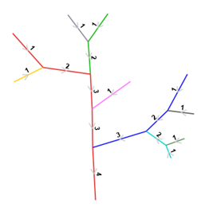

============
Stream Order
============

This document describes the tool developed to compute stream orders, mainstems and other attributes for CHyF2 compliant datasets.

The software is open source under the Apache 2 license. It is written in Java SE 11 (Long Term Support). It can be run directly or by using Python scripts, for example, if desired.

Workflow
--------

-----

The stream order processing is designed to be executed after the hydro network has been converted into the CHyF model. Stream order values should be recomputed whenever any updates are made to the CHyF datasets. Processing is done on the entire CHyF dataset.

.. figure:: img/stream_order/highlvlworkflow.png
    :align: center

    *Figure 1. High level workflow* 

Inputs and Outputs
------------------

-----

The CHyF mainstem/order processing tool requires the CHyF data to be hosted in a PostgreSQL database.  All inputs and outputs are read/written directly from/to the database.

Inputs
~~~~~~

The input data meets the CHyF2 model specifications. The input database schema for the datasets is provided as a parameter (see Running the Software). The stream order computer uses the following tables and associated fields.

.. csv-table:: 
    :file: tbl/so_inputs.csv
    :widths: 30, 70
    :header-rows: 1

Outputs
~~~~~~~

The output table/schema for the results is provided as a parameter (see Running the Software). If the output table exists, it will be dropped and recreated. The table below describes the values computed and the fields in the output table.

.. csv-table:: 
    :file: tbl/so_outputs.csv
    :widths: 20, 10, 70
    :header-rows: 1

Graph ID
++++++++

Each connected graph component is assigned a unique identifier. The graph components are connected subgraphs which have no flowpath connections between them. While not required for mainstem or order processing, it is computed for performance reasons and may be useful for future computations. The graph id is applied to all edges (primary and secondary).

.. figure:: img/stream_order/graphid.png
    :align: center

    *Figure 2. Example data coloured by graph id* 

Mainstem ID
+++++++++++

Mainstems are computed based on the stream network formed by selecting primary, non-bank flowpath edges. All secondary and bank flowpath edges are not assigned a mainstem.

There are two options for computing mainstems:

#. Based entirely on the longest upstream path.
#. Based on both names and the longest upstream path.

Longest Upstream Path Only
``````````````````````````
When computing mainstems based on the longest upstream path, for each sink the flow network is traversed upstream. At each confluence the path with the longest length to the headwaters is selected for the mainstem.  All other edges represent the start of a new mainstem.

.. figure:: img/stream_order/mainstemid.png
    :align: center

    *Figure 3. Example data coloured by mainstem id.*

Names and Longest Upstream Path
```````````````````````````````

Similar to longest upstream path, except at each confluence:

* First look for the upstream edge with the same name as the downstream edge. If found, use this upstream path for the mainstem.
* Second, look for any named upstream edge. If found, use this upstream path for the mainstem. If multiple named edges are found, use the one with the longest length to the headwaters.
* Lastly, use the path with the longest length to the headerwaters.

Mainstem Sequence Number
++++++++++++++++++++++++

The mainstem sequence number orders mainstem edges from the sink to the headwaters. This only applies to edges with mainstems (primary, non-bank flowpath edges).

.. figure:: img/stream_order/mainstemseqnum.png
    :align: center

    *Figure 4. Example data labeled by mainstem sequence numbers.*

Maximum Upstream length
+++++++++++++++++++++++

The maximum upstream length is used for computing mainstem. As with mainstems it is based on the stream network formed by selecting primary, non-bank flowpath edges. All secondary and bank flowpath edges are not assigned upstream length values.

The maximum upstream length is the longest path to a headwaters from the upstream nexus of the edge. As a result, headwater edges will have a value of 0. Length is computed in the same units as the flowpath edge length property.

.. figure:: img/stream_order/uplength.png
    :align: center

    *Figure 5. Example data displayed with values for upstream length (black) and individual edge length (blue).*

Strahler Order
++++++++++++++

Strahler order is computed based on the stream network formed by selecting primary, non-bank flowpath edges. For details see: https://en.wikipedia.org/wiki/Strahler_number.



    *Figure 6. Example data labeled for strahler order.*

Hack Order
++++++++++

Hack order is computed based on the stream network formed by selecting primary, non-bank flowpath edges. For details see: https://en.wikipedia.org/wiki/Stream_order.

.. figure:: img/stream_order/hack.png
    :align: center

    *Figure 7. Example data labeled for hack order.*

Horton Order
++++++++++++

Horton order is computed based on the stream network formed by selecting primary, non-bank flowpath edges. For details see: https://en.wikipedia.org/wiki/Stream_order.

.. figure:: img/stream_order/horton.png
    :align: center

    *Figure 8. Example data labeled for horton order.*

Shreve Order
++++++++++++

Shreve order is computed based on the stream network formed by selecting primary, non-bank flowpath edges. For details see: https://en.wikipedia.org/wiki/Stream_order.

.. figure:: img/stream_order/shreve.png
    :align: center

    *Figure 9. Example data labeled for shreve order.*

Running the Software
--------------------

-----

To run the software use the .bat (windows) or .sh (linux) files provided as follows:

``chyf-streamorder-computer.bat [OPTIONS] <INSCHEMA> <OUTTABLE>``

Example:

``chyf-streamorder-computer.bat -ignorenames -d host=localhost;port=5432;db=chyf;user=user;password=pass chyf2 chyf2.eflowpath_properties``

The following options can be provided:

.. csv-table:: 
    :file: tbl/so_options.csv
    :widths: 20, 10, 70
    :header-rows: 1

`* one of ignorenames or usernames must be provided`

Performance
~~~~~~~~~~~

On large datasets these tools may take a significant amount of time to complete. Logging should provide updates on status.

Logging
~~~~~~~

All logging is written to the console (errors, warning, info). 

Warnings and errors are written to a streamordercomputer-{yyyymmdd}-{hhmmss}.log file.

Algorithm Overview
------------------

-----

NeoJ4 is used as a graph database to aid in these computations. Graph databases are created on-the-fly on the machine running the software and are deleted once the computations are completed.

Stream order is calculated on the entire dataset, however in order to improve performance the first few steps attempt to break down the datasets into smaller datasets.

*The algorithm below was designed to produce results in a reasonable time based on the smallish sample dataset we had. There are a bunch of modifications that could applied depending on the how the performance is on larger datasets.*

Step 1: Compute AOI Groups. This step uses the database to compute AOI groups that are connected. AOIs are considered connected if there are flowpaths in different AOIs that share a nexus. 

The following steps are performed for each AOI group:

2. Load all nexus and flowpaths for the AOI group into a graph database.

3. Compute connected components within this graph. Assign a graph_id to each of these connected components.

4. Find all “connected” graphs with 1 or fewer edges. These graphs have only 1 edge so we can assume each is a unique mainstem with order value of 1.

5. Group remaining connected graphs to form a graph with approximately 1 million nodes or 500 groups.  This is done for performance reasons.  Computing each connected graph individually is very slow.

For each of these groups:

6. Do a breadth-first-search, computing strahler order, max upstream length, mainstem id and shreve order.

7. Reverse the order of the edges from step 6; walk upstream computing horton, hack and mainstem sequence.

8. Save results to the database.
