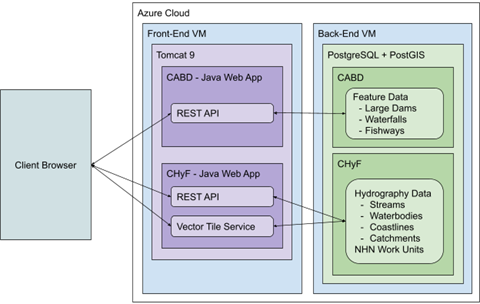

.. _application-architecture:

========================
Application Architecture
========================

This section contains technical details about the current implementation of the Canadian Aquatic Barriers Database (CABD) back-end application, including feaure and vector tile services and the CABD data dictionary. The intended audience are software developers and similar technical users looking to upgrade/maintain the current system or use the API endpoints.

.. _current-application-architecture:

Existing Architecture
---------------------

-----

The current application runs on two Microsoft Azure Java Web App servers, ``cabd-web`` (for CABD data) and ``chyf-web`` (for CHyF data).

.. toctree::
    :hidden:
    
    docs_tech_arch/docs_tech_arch_models
    docs_tech_arch/docs_tech_arch_api
    docs_tech_arch/docs_tech_arch_data_dict
    docs_tech_arch/docs_tech_arch_tiles

