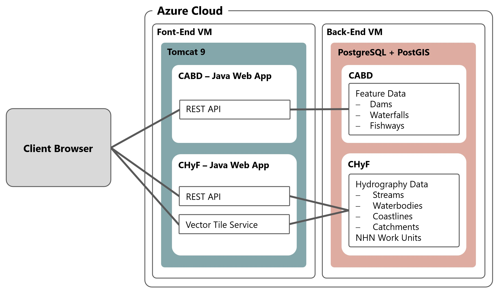

..
    Raw html added to assign styling only to codeblocks being used as headers in this document

.. raw:: html

    

.. role:: codeblocksize

.. _cabd-models:

============================
Features and Database Models
============================

.. _current-application-architecture:

Existing Implementation
-----------------------

-----

The current application runs on two Microsoft Azure Java Web App servers, ``cabd-web`` (for CABD data) and ``chyf-web`` (for CHyF data).

.. _cabd-feature-model:

CABD Feature Model
------------------

-----

.. _generic-feature-model:

Generic Feature Model
~~~~~~~~~~~~~~~~~~~~~

Features in CABD have an optional hierarchical structure. Feature types can be combined to form “super feature types”. 

There are no structures in the software/database that enforce this model. The database views (see section below) are used to define the various feature types and super types. It would be possible for a feature type to be associated with multiple super types, if desired.

.. image:: img/genericmodel.jpg
    :align: center
    :width: 500

.. _implemented-feature-model:

Implemented Feature Model
~~~~~~~~~~~~~~~~~~~~~~~~~

There are currently three feature types and one super type implemented in CABD. Adding additional feature types is expected and the instructions for this are outlined below (How to add new Feature Type).

.. image:: img/implementedmodel.jpg
    :align: center
    :width: 500

Feature types:

- ``barriers`` - a super feature type that includes dams structures and waterfalls.
- ``dams`` - a feature type for features classified as a dam structure.
- ``waterfalls`` - a feature type for features classified as a waterfall.
- ``fishways`` - a feature type for features classified as a fishway structure.
- ``medium`` - a feature type created for testing the increase in data volume expected for stream crossing data.
- ``big`` - a feature type created for testing the increase in data volume expected for stream crossing data.

.. _cabd-database-model:

CABD Database Model
-------------------

-----

The database is structured into multiple schemas.  Each feature type has its own schema, with a common ``cabd`` schema for shared data and feature metadata.

.. _cabd-views:

Views
~~~~~

Each feature type and super feature type has two associated views which supports the api - one view for engligh (_en) and one view for french (_fr). These views should include all fields required for output (either for display on the UI or to support the future editing api).  The view ``cabd.all_features_view_XX`` supports all features api endpoint. 

The views are used to support the CABD APIs that list features. Each feature type is linked to a database view. When requesting features of a specific type the view associated with this type is queried. The fields returned by this view populate the attributes of the feature returned by the API. Feature type views will generally query a single data table (for example, the ``dams`` view queries the dams data table). Super feature types will generally query multiple data tables (for example, the ``barriers`` view queries both the dams data table and the waterfalls data table).

.. _core-tables:

Core Tables
~~~~~~~~~~~

These tables are the core tables for the system and required regardless of the feature types loaded. They support the definition of feature types.

:codeblocksize:`cabd.feature_types`

Lists all the feature types supported by the system.

.. csv-table:: 
    :file: tbl/core-tables.csv
    :widths: 30, 70
    :header-rows: 1

:codeblocksize:`cabd.feature_type_metadata`

Lists all the attributes for a given feature view and the metadata details about the attribute.

.. csv-table:: 
    :file: tbl/feature-type-metadata.csv
    :widths: 30, 70
    :header-rows: 1

:codeblocksize:`cabd.data_source`

Lists data sources. Supports data source tracking for feature type attributes.

.. csv-table:: 
    :file: tbl/data-source.csv
    :widths: 30, 70
    :header-rows: 1

.. _shared-attribute-tables:

Shared Attribute Tables
~~~~~~~~~~~~~~~~~~~~~~~

All of these tables store data that are shared between multiple feature types. Generally, each of these tables have a unique code (for references), a name, and a description.

* ``cabd.barrier_ownership_type_codes``
* ``cabd.fish_species``
* ``cabd.nhn_workunit``
* ``cabd.passability_status_codes``
* ``cabd.province_territory_codes``
* ``cabd.upstream_passage_type_codes``
* ``cabd.census_subdivisions``

.. _feature-tables:

Feature Tables
~~~~~~~~~~~~~~

The feature type data tables are found in their corresponding schema. Generally, there will be one feature data table and a number of reference tables that represent attribute values.  Details for current feature types can be found in the Data Dictionary document.

.. _feature-type-attribute-data-sources:

Feature Type Attribute Data Sources
~~~~~~~~~~~~~~~~~~~~~~~~~~~~~~~~~~~

The CABD database has the option of storing the data source for each attribute associated with the feature type. This has been implemented by having ``<featuretype>.<featuretype>_feature_source`` and ``<featuretype>.<featuretype>_attribute_source`` tables for the feature type.

The ``<featuretype>_feature_source``  table contains for each cabd feature a link to the data source and associated data source feature id.

.. csv-table:: 
    :file: tbl/feature-source.csv
    :widths: 30, 70
    :header-rows: 1

The ``<featuretype>_attribute_source`` table contains the cabd_id and one column for each attribute that requires data source tracking.  The column, ``<attribute>_ds``, links to the ``cabd.data_source table`` to identify the data source for the attribute value.

.. _add-new-feature-type:

How To Add a New Feature Type
-----------------------------

-----

New feature types can be added to the system by adding the data to the database and updating the database metadata tables.

1. Create a new schema for your feature type.

2. Create the required data tables and reference tables to store the feature data and populate these tables. These should exist in their own ``<featuretype>`` schema.

3. Create two views that joins the data table with the reference tables to include all the data you want visible to the ui. One view for English (_en) and one view for French (_fr)  Use one of the existing feature types views as an example (ex. ``cabd.dams_view_en and cabd.dams_view_fr``).

   .. warning::
       When creating and/or updating existing view the role cabd must have permission to use the view (otherwise the application won’t start up).

       ``GRANT ALL PRIVILEGES ON cabd.dams_view_en to cabd;``
       ``GRANT ALL PRIVILEGES ON cabd.dams_view_fr to cabd;``

4. Update the ``cabd.all_features_view_en`` and ``cabd.all_features_view_fr`` to include the data from this new feature type. Use the existing view as an example, appending the new feature type data.

5. If the new feature type is considered a barrier you also need to update the ``cabd.barriers_view_en and cabd.barriers_view_fr`` views.  Use the existing view as an example.

6. Add a row to the ``cabd.feature_types`` table to represent the new feature type.

7. Add rows to the ``cabd.feature_type_metadata table``. One row needs to be added for each column returned by the feature type views created in step 3. You only need to add one set of rows to represent both views.  The software will deal with accessing the _en or _fr view based on the Locale of the data request.
    
   * ``view_name`` – the name of the view without the language suffix (ex. 'dams_view' or 'waterfalls_view' NOT 'dams_view_en'). 
   * ``field_name`` – the name of the field in the view
   * ``name`` – the human friendly name for the column
   * ``description`` – (optional) a description for the column
   * ``is_link`` – true if the column represents a link to another api end point in the application
   * ``data_type`` – data type of the column
   * ``vw_simple_order`` – the order the column should appear in the simple view of the feature (or null if it shouldn’t appear at all in the simple view)
   * ``vw_all_order`` – the order the column should appear in the all info view of the feature (or null if it shouldn’t appear at all)
   * ``include_vector_tile`` – true or false if the attribute should be included in the vector tile of this feature type
   * ``value_options_reference`` – for columns that have a defined list of valid values in another database table (for example: ``province_territory_code``), this field identifies what table the values can be loaded from and what fields in the table that provide the value, name, and description. This column should be null for fields that don’t reference tables; otherwise it should contain a string of the form ``“<tablename>;<valuefield>;<namefield>;<descriptionfield>”``. All are required except ``valuefield`` and ``descriptionfield`` which can be blank.  The ``tablename`` references the code table, the ``valuefield`` the value field in the code table, the ``namefield`` the root human friendly name field in the table, and ``descriptionfield`` the root description field in the table. If ``valueField`` is not provided the ``namefield`` is used as the value. The reference table must have a columns named <namefield>_en, <namefield>_fr, <descriptionfield>_en, <descriptionfield>_fr to support translations. For example: "waterfalls.waterfall_complete_level_codes;code;name;description" -> references the table waterfalls.waterfall_complete_level_codes which must have code, name_en, name_fr, description_en, and description_fr columns.

8. [OPTIONAL] Create the ``<featuretype>.<featuretype>_feature_source`` and ``<featuretype>.<featuretype>_attribute_source tables`` and populate with appropriate data.

9. Restart the web server.  A restart is required to reload the cached metadata.

10. At this point the features should be available in the API.

The new feature type should show up in the types API: ``https://server.ca/cabd-api/features/types/``.

The new features can be accessed from here: ``https://server.ca/cabd-api/features/<newfeaturetype>``.

