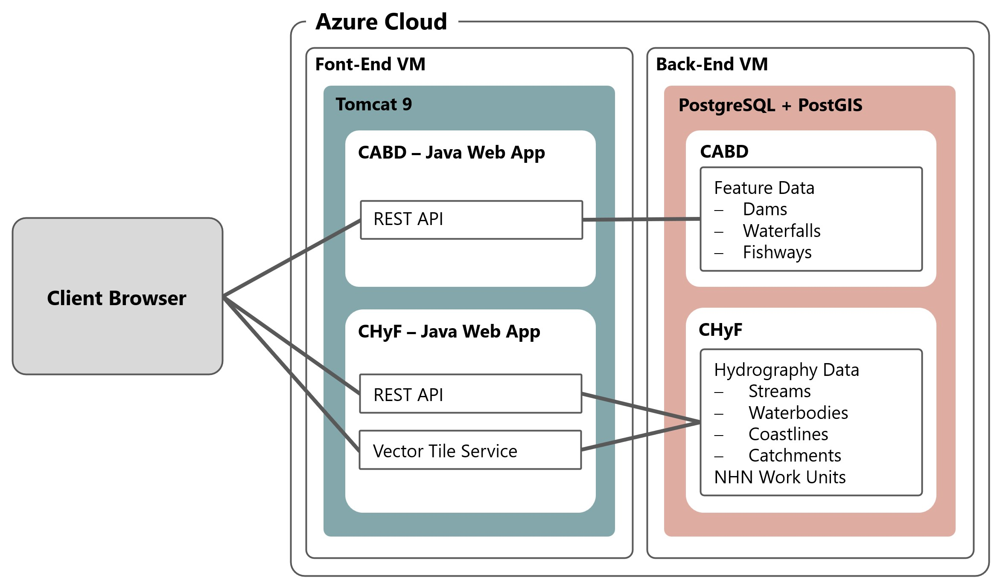
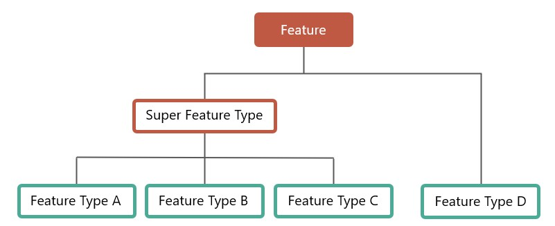
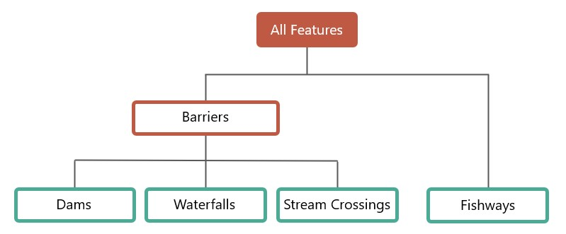

..
    Raw html added to assign styling only to codeblocks being used as headers in this document

.. raw:: html

    

.. role:: codeblocksize

.. _application-architecture:

Application Architecture
########################

This section contains technical details about the current implementation of the Canadian Aquatic Barriers Database (CABD) back-end application, including feaure and vector tile services and the CABD data dictionary. The intended audience are software developers and similar technical users looking to upgrade/maintain the current system or use the API endpoints.

.. _current-application-architecture:

Existing Implementation
***********************

-----

The current application runs on two Microsoft Azure Java Web App servers, ``cabd-web`` (for CABD data) and ``chyf-web`` (for CHyF data).

.. _cabd-feature-model:

.. _cabd-models:

Features and Database Models
****************************

-----

CABD Feature Model
==================

.. _generic-feature-model:

Generic Feature Model
---------------------

Features in CABD have an optional hierarchical structure. Feature types can be combined to form “super feature types”. 

There are no structures in the software/database that enforce this model. The database views (see section below) are used to define the various feature types and super types. It would be possible for a feature type to be associated with multiple super types, if desired.

.. _implemented-feature-model:

Implemented Feature Model
-------------------------

There are currently three feature types and one super type implemented in CABD. Adding additional feature types is expected and the instructions for this are outlined below (How to add new Feature Type).

Feature types:

- ``barriers`` - a super feature type that includes dams, other structures, and waterfalls.
- ``dams`` - a feature type for features classified as a dam or other structure.
- ``waterfalls`` - a feature type for features classified as a waterfall.
- ``fishways`` - a feature type for features classified as a fish passage structure.
- ``medium`` - a feature type created for testing the increase in data volume expected for stream crossing data.
- ``big`` - a feature type created for testing the increase in data volume expected for stream crossing data.

.. _cabd-database-model:

CABD Database Model
===================

The database is structured into multiple schemas.  Each feature type has its own schema, with a common ``cabd`` schema for shared data and feature metadata.

.. _cabd-feature-views:

Feature Views
-------------

Each feature type and super feature type has two associated views which support the API - one view for Engligh (_en) and one view for French (_fr). These views should include all fields required for output (either for display on the UI or to support the future editing API). 

|enfr| 

Views are used to support the CABD APIs that list features. Each feature type is linked to a database view. When requesting features of a specific type the view associated with this type is queried. The fields returned by this view populate the attributes of the feature returned by the API. Feature type views will generally query a single data table (for example, the ``dams`` view queries the dams data table). Super feature types will generally query multiple data tables (for example, the ``barriers`` view queries both the dams data table and the waterfalls data table).

.. _cabd-feature-update-view:

Feature Update View
-------------------

By design each feature includes an updates_pending attribute that is populated with true or false depending on if there are feature updates pending review in the system. This field is populated by the system using the ``cabd.updates_pending`` view. This view should return a single column, cabd_id, for each feature that has a review pending in the database. 

.. _core-tables:

Core Tables
-----------

These tables are the core tables for the system and required regardless of the feature types loaded. They support the definition of feature types.

:codeblocksize:`cabd.feature_types`

Lists all the feature types supported by the system.

.. csv-table:: 
    :file: tbl/core-tables.csv
    :widths: 30, 70
    :header-rows: 1

:codeblocksize:`cabd.feature_type_metadata`

Lists all the attributes for a given feature view and the metadata details about the attribute.

.. csv-table:: 
    :file: tbl/feature-type-metadata.csv
    :widths: 30, 70
    :header-rows: 1

:codeblocksize:`cabd.data_source`

Lists data sources. Supports data source tracking for feature type attributes.

.. csv-table:: 
    :file: tbl/data-source.csv
    :widths: 30, 70
    :header-rows: 1

.. _shared-attribute-tables:

:codeblocksize:`cabd.contacts`

A list of contacts relevant to the CABD database.  Currently, contacts are only created when a user submits a feature update.

.. csv-table:: 
    :file: tbl/contacts.csv
    :widths: 30, 70
    :header-rows: 1

:codeblocksize:`cabd.user_feature_updates`

Users can use the Features API to submit updates to features. All submissions are stored in this table.

.. csv-table:: 
    :file: tbl/user_feature_updates.csv
    :widths: 30, 70
    :header-rows: 1
    
        
Shared Attribute Tables
-----------------------

All of these tables store data that are shared between multiple feature types. Generally, each of these tables have a unique code (for references), a name, and a description.

* ``cabd.barrier_ownership_type_codes``
* ``cabd.fish_species``
* ``cabd.nhn_workunit``
* ``cabd.passability_status_codes``
* ``cabd.province_territory_codes``
* ``cabd.upstream_passage_type_codes``
* ``cabd.census_subdivisions``

.. _feature-tables:

Feature Tables
--------------

The feature type data tables are found in their corresponding schema. Generally, there will be one feature data table and a number of reference tables that represent attribute values.  Details for current feature types can be found in the Data Dictionary document.

.. _feature-type-attribute-data-sources:

Feature Type Attribute Data Sources
-----------------------------------

The CABD database has the option of storing the data source for each attribute associated with the feature type. This has been implemented by having ``<featuretype>.<featuretype>_feature_source`` and ``<featuretype>.<featuretype>_attribute_source`` tables for the feature type (e.g., ``dams.dams_feature_source`` and ``dams.dams_attribute_source``).

For each cabd feature, the ``<featuretype>_feature_source``  table contains a link to the data sources and associated data source feature ids that the feature was found in. For example, a dam feature that was found in both the nrcan_canvec_mm and bceccs_fiss data sources would have two entries for its ``cabd_id`` in the ``<featuretype>_feature_source`` table.

:codeblocksize:`<featuretype>_feature_source`

.. csv-table:: 
    :file: tbl/feature-source.csv
    :widths: 30, 70
    :header-rows: 1

The ``<featuretype>_attribute_source`` table contains the cabd_id and one column for each attribute that requires data source tracking.  The column, ``<attribute>_ds``, links to the ``cabd.data_source table`` to identify the data source for the attribute value.

:codeblocksize:`<featuretype>_attribute_source`

.. csv-table:: 
    :file: tbl/feature-attribute.csv
    :widths: 30, 70
    :header-rows: 1

.. _audit_log:
    
Audit Log / Change Tracking
---------------------------

The CABD database has tracks changes to the following tables:

* cabd.contacts
* cabd.fish_species
* cabd.data_source
* dams.dams
* dams.dams_attribute_source
* dams.dams_feature_source
* waterfalls.waterfalls
* waterfalls.waterfalls_attribute_source
* waterfalls.waterfalls_feature_source
* fishways.fishways
* fishways.fishways_attribute_source
* fishways.fishways_feature_source
* fishways.species_mapping

New feature types can also include change tracking by applying the appropriate triggers to any new database tables that require change tracking.

All changes are logged in the ``cabd.audit_log`` table. This table has the following columns:

.. csv-table:: 
    :file: tbl/audit_log_table.csv
    :widths: 30, 70
    :header-rows: 1

.. _audit_log:
    
