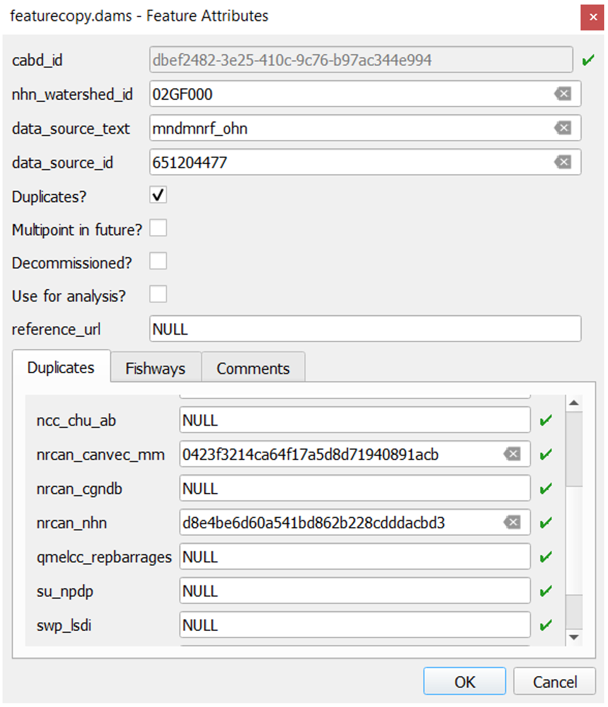
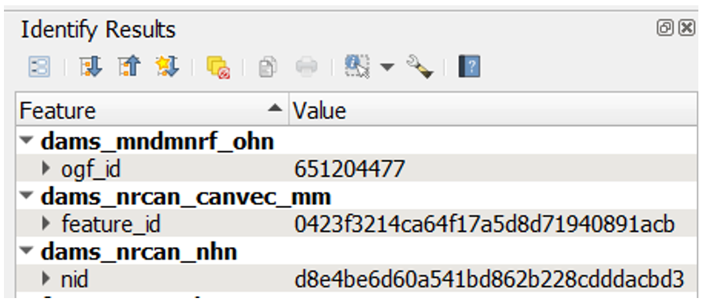

.. _reviewmethods:

===================================================
Data Processing Methods: Dams, Fishways, Waterfalls
===================================================

The data in the Canadian Aquatic Barriers Database (CABD) has been compiled from a number of different spatial and non~spatial datasets. This section provides an overview of the methods used to validate, de~duplicate and standardize existing spatial datasets to match the CABD data structure.

.. note::

    In the CABD, the term ‘feature’ is used to reference an individual structure that represents a dam, waterfall, or fishway. In this section, the term ‘feature point’ is used to represent the geographic point location of a feature.

Duplicate identification and tracking
~~~~~~~~~~~~~~~~~~~~~~~~~~~~~~~~~~~~~

Generating the review layer
+++++++++++++++++++++++++++

The first step of the process is to generate a review layer that records potential duplicate points from source datasets. The information in this review layer will then be manually reviewed and verified. 

The inputs for the review layer include a predefined area of interest (AOI) and a set of source datasets for the AOI ~ ideally, all known and publicly available source datasets. After identifying the source dataset with the highest number of feature points in the AOI, the feature points of this dataset are extracted to form the foundation of the ‘starting layer’. 

The starting layer is buffered to determine the most appropriate buffer distance that contains the majority of feature points from other source datasets that represent the same structures (i.e., duplicates), and disjoints those that represent different structures (i.e., non~duplicates). This buffer distance is typically around 50~100 m.

Next, the ‘Join attributes by nearest’ tool in QGIS is used to join the unique ids from a second source dataset with the features of the starting layer, based on the determined tolerance. The resulting output is a new version of the review layer that contains an additional field in the attribute table which holds the unique id of each assumed duplicate from the second source dataset. This tool is run repeatedly for the remaining source datasets, using the generated output of each run as the input layer for the next join. 

Once all runs have completed, feature points from each source dataset that fall outside the determined tolerance, but within the AOI, are selected and the entire process is repeated with a new ‘starting layer’, beginning with the source dataset that has the most features selected. 

Once most source dataset features are captured, all output layers are merged to create the final version of the review layer. To facilitate the review process, a handful of fields are also added at this point to the review layer to track additional details about features, and a custom attribute form display in QGIS is created. Once this final review layer is completed, it is loaded into a PostgreSQL database with the PostGIS extension to allow for reviewers to work simultaneously to verify feature point locations and information.

Verifying the location of structures using satellite imagery
++++++++++++++++++++++++++++++++++++++++++++++++++++++++++++

The first step to verify feature points in the review layer is to try and confirm that the feature point is in the correct location. To do this, the reviewer will examine the feature point’s position relative to the location of the corresponding structure in satellite imagery, if visible. If a structure is not visible in the satellite imagery, the reviewer will review information about the structure available from the source datasets or research the structure online to confirm the structure’s location, determine if the structure has been removed or decommissioned, and relocate the feature point if necessary. 

If the structure has not been decommissioned, the reviewer will then assess the location of the feature point relative to the hydrographic network. If the feature point is located more than 50 m away from the closest hydro network flowpath, and is believed to be blocking flow, the reviewer will relocate the feature point to where the structure intersects with the flowpath (see section ‘:ref:`To snap, or not to snap <snapping>`’).

Unless source datasets or additional research indicate that a structure has been removed, it is assumed that all structures from the source datasets exist. Therefore, if a reviewer cannot confirm the existence or location of the structure, the feature point is left in its original location from the source dataset.

Verifying duplicate feature points of the review layer
++++++++++++++++++++++++++++++++++++++++++++++++++++++

While the semi~automated process of generating the review layer is used to quickly capture most duplicate ids, it isn’t expected to produce a perfect result. Therefore, each feature point requires manual review to verify that all duplicate ids from the source datasets are being tracked correctly in the review layer, and to add any feature points that were missed during the join process. 

This is done by cross referencing the unique ids present in the ‘Duplicates’ tab (Fig. 1) of the review layer’s attribute form with the corresponding ids from source dataset features (Fig. 2) that are located nearby. If a feature’s unique id is missing from the ‘Duplicates’ tab, the feature is investigated further (e.g., checking if structure names match, examining the satellite imagery for an additional structure, etc.) to determine if it corresponds to the same structure. If the missing feature is determined to be a duplicate, the unique id is manually added to the corresponding datasource field in the ‘Duplicates’ tab. If the feature is not a duplicate, a new feature point is manually added to the review layer, inputting the source dataset name and id from the original source dataset.

    Figure 1. The review layer attributes form showing the original data source and data source id of a feature point (data_source_text and data_source_id), and the unique ids of feature points (recorded in the ‘Duplicates’ tab) that were identified as duplicates of this structure from other source datasets.

    Figure 2. Example of unique ids of source dataset feature points.

Occasionally, the review layer may include several distinct feature points that appear to correspond to a single structure on the ground. This typically results from differing geographic accuracy of point locations in source datasets. In these cases, the attributes of each source dataset feature point in the location are compared to determine if there should be one feature point at this location, or multiple feature points. If there should only be a single feature point, the unique ids from each source dataset for that point are added to the appropriate data source fields in the ‘Duplicates’ tab of a single feature point, and all other duplicate feature points are removed.

.. _snapping:

To snap, or not to snap
~~~~~~~~~~~~~~~~~~~~~~~

Does the structure block flow?
++++++++++++++++++++++++++++++

Since not all feature points representing a dam or other structure act as a potential longitudinal barrier to flow, a boolean field is added to the review layer to indicate if a feature point should or should not be snapped to the hydrographic network layer and therefore used for network analysis. This field is called ‘use_analysis’, or ‘Use for analysis?’ in the attribute form (Fig. 1). 

When reviewing a feature point, the reviewer assesses its location relative to the flowpath (i.e., a stream or river) or waterbody (i.e., lake or double line river) and examines the information provided in the attribute table. If the attribute information available for the feature is limited, the reviewer may need to research the structure further to determine if it is a longitudinal barrier.

If a feature is identified as a barrier blocking upstream and downstream flow, the reviewer would set the ‘use_analysis’ field value for the feature point to ‘true’. Once feature review is complete, all features with a value of ‘true’ in the ‘use_analysis’ field will be snapped to a hydro network flowpath using a specified buffer distance ~ typically 50 m. If hydro networks are not yet available for the area, these features can be re~snapped in the future when hydro networks are available.

If a feature is identified as an auxiliary structure (e.g., saddle dam, dyke, canal wall, etc.,), it is considered a lateral barrier (i.e., not blocking upstream and downstream flow). In this case, the reviewer would set the ‘use_analysis’ field value for the feature point to ‘false’. All features with a value of ‘false’ in the ‘use_analysis’ field would not be snapped to the hydro network and thus omitted from future geospatial analysis.

.. figure:: img/useanalysis.png
    :align: center
    :width: 75%

    Figure 3. An example illustrating the logic used when determining if a feature point should or should not be used for analysis, snapped or not snapped to the hydrographic network, respectively. Shown are three feature points, each from a different source dataset: blue ~ dyke that is acting as a lateral barrier, red ~ embankment dam acting as a longitudinal barrier, green ~ duplicate of the red feature point. The flow in this area is represented by the red dotted line; arrows indicate the flow direction.  

Fishway structures are treated differently than barrier structures as their purpose is to facilitate fish passage past structures like dams, culverts or waterfalls. Considering that fishway structures do not act as barriers to fish passage, these features are always assigned a ‘use_analysis’ value of ‘false’, and flagged as a fishway by setting the ‘fishway_yn’ field value to ‘true’. If the feature point identified as a fishway corresponds to an existing record from the CANFISHPASS database, the unique id from CANFISHPASS is also recorded.

Structures that block flow in multiple locations
++++++++++++++++++++++++++++++++++++++++++++++++

Occasionally, a single feature will be blocking flow at multiple locations (fig. 4). In a case like this, a single feature point is not sufficient and a multipoint feature would be required to place a point at each location where flow is blocked by the structure.

The CABD does not currently support multipoint features, so the ‘multipoint_yn’ field will be set to ‘true’ by the reviewer if the structure should be represented as a multipoint in the future. These structures will be represented as a single point in the existing version of the CABD, typically placed along a primary flowpath.

.. figure:: img/multidamb.png
    :align: center
    :width: 75%

    Figure 4. An embankment structure that is blocking flow at two separate locations. A multipoint feature is required.

Last steps
~~~~~~~~~~

Once the review process is complete, and all feature points in the review layer are verified, attributes from source datasets can be mapped to the feature points in this final review layer to match the CABD data structure.

Stream Crossings
----------------

Stream crossings in the CABD are compiled from a variety of sources. The starting point are “modelled stream crossings” ~ which are identified by finding places where the stream network intersects a road, railway, or trail. 

Then, inventories of bridges, culverts, and other structures help fill in data gaps by identifying structure types for modelled crossings.

Finally, stream crossing assessment data is incorporated to fill in more detailed information that will help in determining whether the crossing is passable to fish, such as the number of crossing structures, crossing condition, outlet shape, and whether the water depth and velocity through the crossing match the natural stream conditions.

## Generate modelled stream crossings

Modelling stream crossings is an important first step to identify areas where human~made structures may be blocking fish passage. The CABD team compiles authoritative data about transportation networks ~ roads, railways, and trails ~ for each province and territory and runs a model that identifies all the areas where these transportation networks intersect a stream from NRCan’s National Hydrographic Network (NHN).

The model automatically clusters crossings within a specified distance (which may differ between provinces and territories) and removes duplicate stream crossings based on a set of rules. Some of these rules include:

~ If there are multiple modelled crossings within 20 m of each other, keep only the most downstream crossing
~ Flag crossings for removal that are on winter roads, canoe routes, or ferry routes
~ Flag crossings for removal where the transportation network indicates the crossing has been removed

Since crossings associated with railway networks are often separate from those on other nearby roads or trails, modelled crossings on railways are generally clustered and de~duplicated separately. However, in some areas of Canada, old railway lines have been converted to ‘rail trails’, which may result in two crossings being generated on each of the railway and trail lines. In these cases, the modelled crossing on the railway is kept, but relevant information from the trail layer (trail name and trail association) is added to these points, along with a comment indicating that the point is on a rail trail.

The scripts used to generate modelled stream crossings are available at https://github.com/Canadian~Wildlife~Federation/CABD/tree/main/cabd~database/barriers/stream_crossings.

## Clean up modelled stream crossings

As modelled stream crossings are generated from the intersection of transportation networks and stream networks, there are often useful pieces of information from these networks that can be added to the crossing, such as:

~ road/railway/trail name
~ stream name
~ stream order ~ this is a proxy for stream size, where larger streams fed by multiple tributaries typically have a larger stream order
~ type of road ~ e.g., highway, residential, arterial
~ type of crossing ~ some networks may have separate sections that indicate bridges, culverts, or other structures
~ owner or operator of the road, railway, or trail

Crossings that are on a stream order 6 or higher stream are also automatically given a crossing type of ‘bridge’, as it’s assumed that most crossings on these larger streams would be bridges.

## Incorporate structure inventories

When structure inventories are openly available for a province/territory, city, or region, this information is added to stream crossings to help identify the locations of culverts and bridges.

As each inventory is unique, the CABD team reviews each dataset for relevant information, determines an appropriate distance for matching structure points to modelled crossings, and checks the results of these matches before finalizing.

Bridges are particularly important to identify, as these structures are passable to fish in almost all cases. Finding the locations of bridges lets us remove these from the count of barriers to fish in a watershed.

To identify if a structure inventory was used to help fill in information about a particular crossing, refer to the `crossing_type_source` and cross~reference this value with the CABD data sources page: https://cabd~docs.netlify.app/docs_user/docs_user_data_sources

## Manual review

The CABD team also carries out a number of checks manually using satellite imagery to supplement the information described above. Some of these checks include:

~ Review all crossings classified as bridges based on stream order.
    ~ During this check, some crossings may be changed to ‘culvert’ or ‘multiple culvert’, or marked for removal if there is no permanent stream crossing infrastructure at that location.
    ~ Some bridges may also have multiple crossing points representing them ~ in these cases, only a single crossing point is kept.
~ Review all crossings within 25 m of another crossing to confirm if there are multiple separate crossings in that location
~ Review all crossings within 45 m of a dam to confirm if the crossing exists, and is separate from the dam structure
~ Review all crossings that are on the same transportation network segment and stream segment. These typically result from streams that are represented as flowing nearly parallel to a transportation network, but may occur in other areas with a high density of roads or railways such as highway on/off ramps and interchanges, train yards, and residential areas.
~ Review all crossings on a named watercourse where the name includes ‘River’ or ‘Rivière’. These are often bridges.