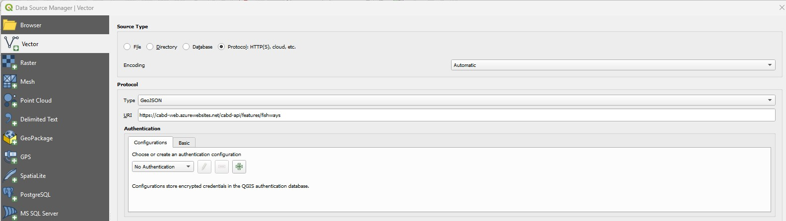
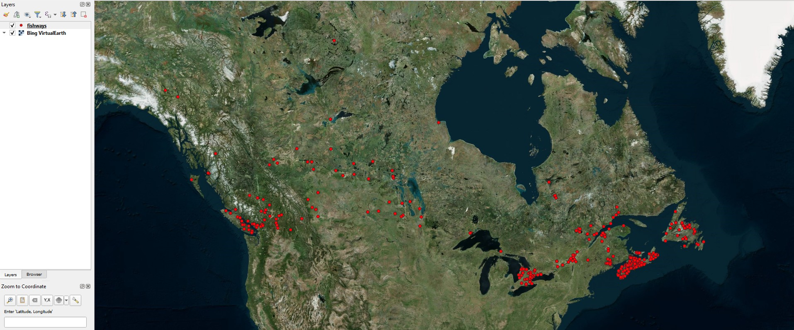

.. _api:

===================
Connect to API in GIS 
===================
An API is a tool that allows different applications to interact and share information (e.g., GIS software interacting with the Aquatic Barriers Database), making it easier to access and integrate spatial data. 

Connecting to the Aquatic Barriers API enables access to real-time barrier data (e.g., dams, waterfalls, fishways) in an efficient and streamless process; rather than downloading these datasets individually. Through either QGIS or ArcGIS, you can connect to the API and specify data you are interested in. 

The base URL for any API query in the CABD is : https://cabd-web.azurewebsites.net/cabd-api. This refers to the root address or endpoint from which all API requests are made. It serves as the foundation for the complete API URL, which is combined with specific paths or parameters to access specific resources or data within the API. For more information on the API or to view detailed examples, visit `CABD REST API Services <https://cabd-docs.netlify.app/docs_tech/docs_tech_arch_api>`_. 

Below you will find instructions for connecting to the APi in either QGIS or ArcGIS. 

.. note::
    For any API query, a maximum of 55,000 features is returned. This is configurable and may be modified if required. If you are unable to return a specific query, try to be more specific.

Connecting to API in QGIS 
--------------------------------

To add a API layer in QGIS, you need to navigate to add new **vector layer** tab. In the vector layer tab, you will select/input the following:

- Source Type: Protocol: HTTP(S), cloud, etc. 
- Encoding: automatic
- Type: GeoJSON
- URI: API Request (e.g., https://cabd-web.azurewebsites.net/cabd-api/features/fishways)
- Configurations: default

After inputting the details above, you can now add the vector layer to your map. Depending on the request, the API layer may take a few minutes to display. After loading, you will see a new layer in your layers tab and points representing your request (e.g., fishways). 

Connecting to API in ArcGIS 
---------------------------------
**Connecting to API via Python Script**

To add a API layer in ArcGIS, you need to open Python and insert a number of lines to specify the data you are interested in.

.. admonition:: Python Example

    | ``import os``
    | ``import requests``
    | ``import re``
    | # Define the directory where you want to save the downloaded files 
    | ``download_directory = 'your_directory'``
    | #List of hyperlinks (URLs) to download data from - you will specify the barrier data (e.g., dams, waterfalls, fishways) you are interested in along with other criteria (e.g., province/territory, operating status, etc.) 
    | ``urls = [``
    | ``"insert here"``
    | ``"you can insert more than one"``
    | ``]``
    | #Predefined filenames (you can modify this list as needed - names will coordinate in the same order as the URLs)
    | ``filenames = [``
    |  ``"first_name",``
    |  ``"second_name",``
    | ``]``

Below is an example with Ontario dams and waterfalls specified.

.. Note:: Python Example with Specific Data 
      | ``import os``
    | ``import requests``
    | ``import re``
    | # Define the directory where you want to save the downloaded files 
    | ``download_directory = 'your_directory'``
    | #List of hyperlinks (URLs) to download data from - you will specify the barrier data (e.g., dams, waterfalls, fishways) you are interested in along with other criteria (e.g., province/territory, operating status, etc.) 
    | ``urls = [``
    | ``""https://cabd-web.azurewebsites.net/cabd-api/features/dams?filter=province_territory_code:eq:on&format=geopackage"``
    | ``""https://cabd-web.azurewebsites.net/cabd-api/features/waterfalls?filter=province_territory_code:eq:on&format=geopackage"``
    | ``]``
    | #Predefined filenames (you can modify this list as needed - names will coordinate in the same order as the URLs)
    | ``filenames = [``
    |  ``"on_dams",``
    |  ``"on_waterfalls",``
    | ``]``

**Connecting to API via the Insert Tab**

To add a API layer in ArcGIS, you need to navigate to the **Insert tab** and select **Add Data > Data from Path**. 

- Paste the GeoJSON URL into the path input (e.g., https://cabd-web.azurewebsites.net/cabd-api/features/types/dams).
- If the URL returns GeoJSON data, it will be added to the map as a feature layer. 
