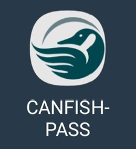
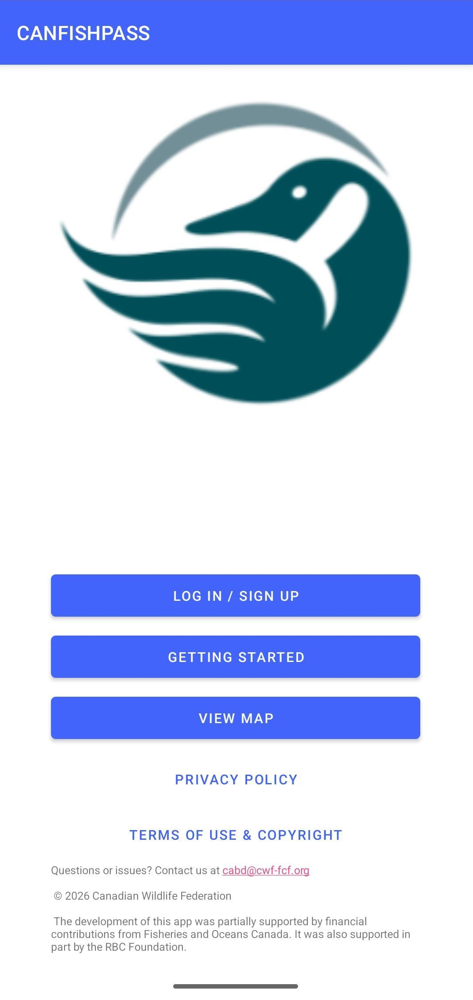
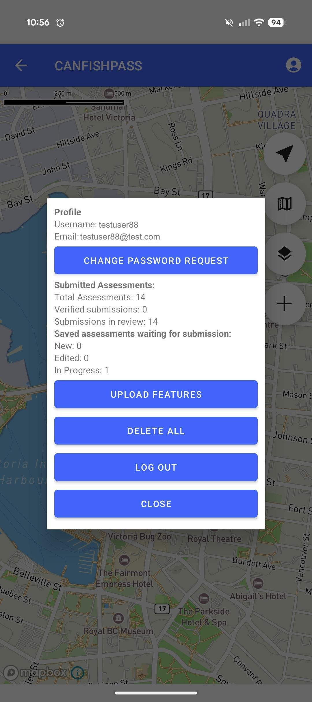
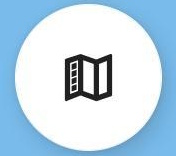
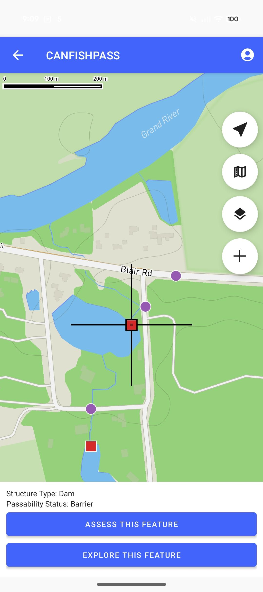
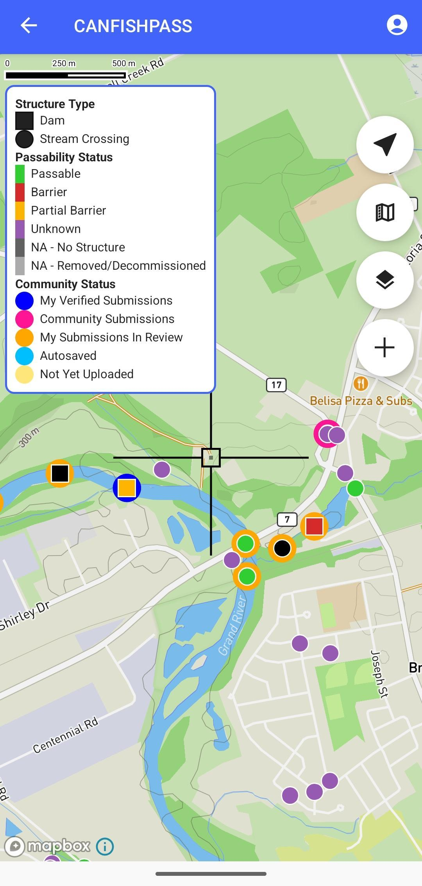
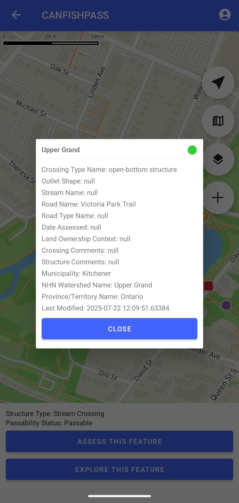
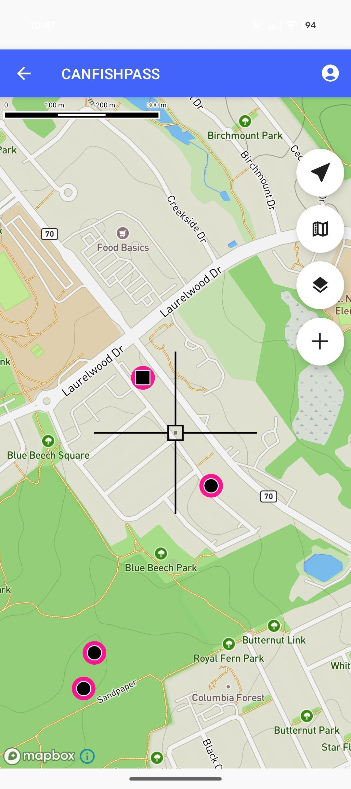
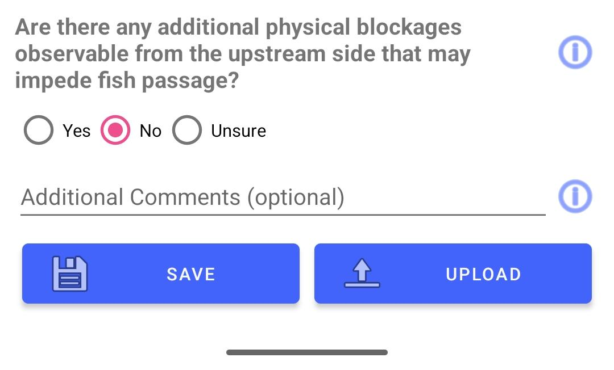

.. _android-user-guide:

=============================
Android User Guide
=============================

App Access and Installation
----------------------------
You can download the mobile app (CANFISHPASS) from the `Google Play store <https://play.google.com/store/apps/details?id=com.foundry.cabdapp>`_. Once installed, the app will be accessible by clicking the CWF logo app icon. 

App Overview and Guidance
----------------------------

- :ref:`Getting Started on the App <getting-started-android>`
- :ref:`A summary of the user interface components <interface-android>`
- :ref:`Navigating the map space and barrier symbology <navigation-android>`
- :ref:`Assessing barrier features <assessing-barriers-android>`

.. _getting-started-android:

Getting Started
^^^^^^^^^^^^^^^^

From the home screen, you can log in or create an account, open this Getting Started guide, or view the map. You can view the map without needing to log in.

# TO DO: REPLACE THIS IMAGE once login button is added

.. _interface-android:

Interface Components
^^^^^^^^^^^^^^^^^^^^^^

While in the map view, click the profile icon at the top right to open your profile details and view or managed your uploaded and saved features. (For more details, see :ref:`Using the Feature Cache to Upload Saved Assessment Submissions <feature-cache-android>`.)

.. _app-toggles-android:

Below the three vertical dots, you'll see three buttons which gives you access to key features in the app. 

Here’s a quick summary of what each one does:

.. _my-location-android:

.. list-table:: Interface Components
   :widths: 25 25 50
   :header-rows: 1

   * - Icon
     - Name 
     - Functionality

   * - |logo6|
     - My Location
     - Snap the map view back to your current location. Your location must be enabled to use this feature. 

   * - |logo7|
     - Legend
     - Open a legend for features displayed on the map. 

   * - |logo8|
     - Base Map and Layer Toggle
     - Toggle between satellite map style and base map style, and toggle dam or stream crossing layers on or off.  

   * - |logo9|
     - Add New Feature
     - Adds a new barrier feature point that does not already exist on the map. See :ref:`adding and assessing a new barrier below for more information on adding new features <adding-assessing-new-barriers-android>` for more details.  

.. _navigation-android:

Navigating the Map Space and Barrier Symbology
^^^^^^^^^^^^^^^^^^^^^^^^^^^^^^^^^^^^^^^^^^^^^^^

On the map space page, you should see your current location along with the default base map. If your location is not automatically displayed, ensure that your device’s location services are enabled and that the app has permission to access your location. Once permissions are confirmed, open the app menu and tap ‘My Location’ (see above) to center the map on your current position.

You can navigate the map space using standard Android gestures:

- Tap and drag to pan around the map
- Pinch to zoom in or out

If you zoom out too far on the map, barrier features will be hidden to improve app performance. As you zoom back in, they will reappear.

If this is your first time using the app, take a second to view some of the dams and stream crossings near your location. 

You’ll also notice a small black crosshair at the center of the screen (see image below). This is the app cursor, which helps you select barrier points on the map. To select a barrier, simply drag the map until the crosshair aligns with the barrier of interest.

Once the crosshair is aligned with a barrier point, an information box will appear at the bottom of the screen. This box displays the barrier ID, structure type, and passability status, along with ‘EXPLORE THIS FEATURE’ and ‘ASSESS THIS FEATURE’ buttons.

Dams are represented as squares, and stream crossings are represented as circles. The colour of each icon indicates the passability status. Use the legend button to identify what each colour means.

You may also see different-coloured haloes around features as you start :ref:`assessing barriers <assessing-barriers-android>` or if other users have assessed barriers near you.

.. _exploring-barriers-android:

Exploring Barriers
^^^^^^^^^^^^^^^^^^^

Once the crosshair is aligned with an existing barrier point, an information box will appear at the bottom of the screen with the structure type and passability status.

Click ‘EXPLORE THIS FEATURE’ to open the barrier information window.

This will display the existing information known about the structure from the Canadian Aquatic Barriers Database (CABD). You'll likely see lots of NULL values here - so any information you can provide helps us improve our database!

.. _assessing-barriers-android:

Assessing Barriers
^^^^^^^^^^^^^^^^^^^

All dams and stream crossings displayed on the map come from the Canadian Aquatic Barriers Database (CABD). With this app, you can either:

- Assess existing barriers
- Create new barrier features that does not yet exist in the CABD

To begin, align the crosshair with an existing barrier point, or move it to the location where you'd like to add a new barrier.

**Assessing Existing Barriers**

Once the crosshair is aligned with an existing barrier point, an information box will appear at the bottom of the screen with the structure type and passability status.

Click ‘ASSESS THIS FEATURE’ to open the assessment form.

Tip: If you're unsure what a question is asking, or how to respond, tap the Info icon at the top right of the question for additional details. 

.. raw:: html

    <video controls width="600"><source src="../../_static/android_assess_existing.mp4"></video>

The first question will ask, “This structure is currently identified as (either a dam or a stream crossing), is this correct?""

- If the default structure type is correct, simply tap ‘Yes’ to proceed.
- If the structure type is incorrect, then tap ‘No’ if you know what structure type it is, or ‘Unsure’ in all other cases.

Next, indicate if you are able to access the site for further assessment. If you can't access the site, you will be able to submit your assessment after choosing a reason why the site can't be accessed.

If you can access the site, an additional set of assessment questions and photo prompts specific to that structure type or accessibility status will appear. Note that all questions must be filled out to save and submit your assessment.

.. _adding-assessing-new-barriers-android:

**Adding and Assessing a New Barrier**

If you find a dam or stream crossing that is not shown on the map (i.e., not already in the CABD), you can add a new feature and complete an assessment for it.

To add a new feature:

#. Use the ‘Go to Your Location’ button if you're physically at the structure site, or manually drag the crosshair to the correct location on the map.
#. Once the crosshair is at the appropriate spot, tap the plus sign button in the app menu. This will open the rapid assessment form.

.. raw:: html

    <video controls width="600"><source src="../../_static/android_assess_new.mp4"></video>

Once you select the structure type, additional assessment questions and photo prompts will appear. 

Once a new barrier assessment has been saved or uploaded, a black feature point will appear on the map at the assessment location — a square for dams and a circle for stream crossings.

.. _saving-uploading-assessments-android:

**Saving and Uploading Barrier Assessment Submissions**

Once you’ve completed all the questions in the assessment form, you’re ready to save or upload your assessment. At the bottom of the form, you’ll see two buttons: ‘SAVE’ and ‘UPLOAD’.If these buttons are greyed out, this means you haven't filled out all of the required questions in the assessment form. 

Clicking ‘SAVE’ will store the assessment locally on your device so that you can upload it later. The ‘SAVE’ function works whether you’re online or offline, including when connected to Wi-Fi, using cellular data, or with no service at all.

When an assessment is saved, the associated feature point will appear on the map with a yellow halo. You can reopen a saved form at any time to review or edit the content before choosing to either save it again or upload it. 

Clicking ‘UPLOAD’ will both save and immediately upload the completed assessment to the database. Once uploaded, the feature point will be displayed on the map with a green halo. You can open and review the content of an uploaded assessment, but you cannot edit it after it has been submitted. The ‘UPLOAD’ button appears blue when you have a Wi-Fi or cellular connection and is greyed out when offline. You can only upload assessments when you are connected to the internet. If you're offline, use the ‘SAVE’ button instead and upload your completed assessments once a connection is available.

.. _feature-cache-android:    

**Using the Feature Cache to Upload Saved Assessment Submissions**

If you have multiple saved assessments that you want to upload all at once, open the Profile window at the top right of your screen. You’ll see a summary of the features you’ve already uploaded, as well as a list of saved assessments that are still waiting to be uploaded. 

While in this window, you can tap the ‘UPLOAD FEATURES’ button to submit all saved assessments at once. Once the upload is complete, the counts of saved assessments will be reset to zero.

.. figure:: img/profile_screen.png
    :align: center
    :width: 50%

You will also see a  ‘DELETE ALL’ button on this screen. This button will remove all assessment data saved locally in the app, but will NOT delete any information from the CWF database.

The ‘DELETE ALL’ button is intended to help clear the app’s memory if performance becomes sluggish due to a large number of saved or uploaded features. You should only use this button if you are experiencing app performance issues, and it is essential to ensure that all saved features have been uploaded from the feature cache before doing so to avoid losing any unsubmitted data.