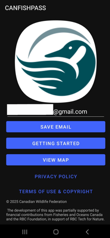
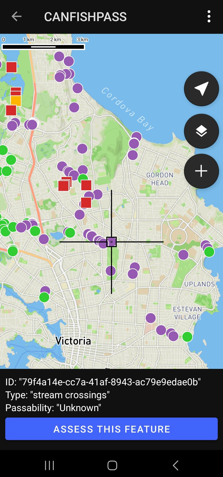
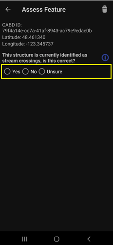
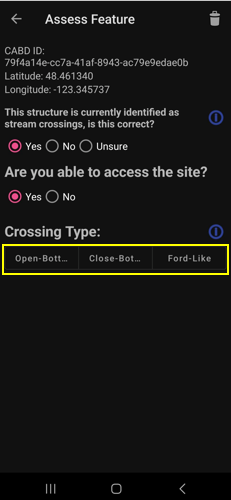
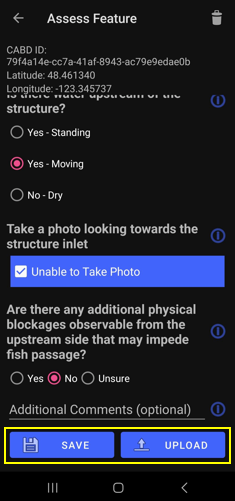
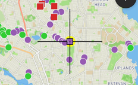

.. _android-user-guide:

=============================
Android User Guide
=============================

The CABD has compiled information on dams, waterfalls, stream crossings, and fishways from over 800 data sources; however, there is still many missing structures and a need to fill in information gaps for the majority of existing points. To address these data gaps, tools are being developed to enable individuals across the country to contribute information to the CABD. The CABD Rapid Barrier Assessment Android mobile app is one such tool.

App Access and Installation
----------------------------
You can download the mobile app (Aquatic Barrier Ranger) from the Google Play store. Once installed, the app will be accessible on your phone with the CWF logo as the app icon. 

.. figure:: img/android_app_phone.png
    :align: center
    :width: 20%

You are now ready to open and explore the app!

App Overview and Guidance
----------------------------
This page contains information on:

- :ref:`Getting Started on the App <getting-started>`
- :ref:`A summary of the user interface components <interface>`
- :ref:`Navigating the map space and barrier symbology <navigation>`
- :ref:`Assessing barrier features <assessing-barriers>`

.. _getting-started:

Getting Started
^^^^^^^^^^^^^^^^

Once the app is downloaded and installed, you can open it from your device’s home screen. When you first open the app you will be greeted with a home screen that has the CWF logo and a text box where you'll enter your email address and click "SAVE EMAIL". Once the email is correct and saved, you can click ‘VIEW MAP’, which will bring you to the main app page and map space. 

.. _interface:

Interface Components
^^^^^^^^^^^^^^^^^^^^^^

Once you’ve navigated past the home screen, the main map space of the app will appear. In the top-right corner of the screen, you’ll see a gear icon and three vertical dots (see image below). Tap the gear icon to open the Settings window. From there, you can refresh map features and view or manage your cache of assessed features. (For more details, see :ref:`Using the Feature Cache to Upload Saved Assessment Submissions <feature-cache>`.)

.. figure:: img/android_map_icons.png
    :align: center
    :width: 30%

The three vertical dots to the right of the gear icon open the app menu. Within this menu, you'll find the following options:

.. _app-toggles:

#. **"Go to your Location"**: Snaps the map view back to your current location
#. **"Satellite Map Style"**: Toggles satellite imagery on and off.
#. **"Toggle Dams"**: A checkbox that toggles the visibility of dams features. 
#. **"Toggle Stream Crossings"**: A checkbox that toggles the visibility of stream crossing features. 
#. **"Download Map Tiles"**: Currently inactive; clicking this button will not perform any action.
#. **"Create New Features"**: Adds a new barrier feature point that doesn't already exist on the map (For more details, see :ref:`Adding and Assessing a New Barrier below for more information <adding-assessing-new-barriers>`).

.. _navigation:

Navigating the Map Space and Barrier Symbology
^^^^^^^^^^^^^^^^^^^^^^^^^^^^^^^^^^^^^^^^^^^^^^^

On the map space page, you should see your current location along with the default base map. If your location is not automatically displayed, ensure that your device’s location services are enabled and that the app has permission to access your location. Once permissions are confirmed, open the app menu and tap ‘Go to Your Location’ to center the map on your current position.

Within the map space, you’ll also see aquatic barrier layers:

- Dams – represented by squares
- Stream Crossings – represented by circles

While there is currently no in-app legend, the color of each icon indicates the passability status:

- Green - Passable 
- Orange - Partial Barrier
- Red - Barrier
- Purple - Unknown 

.. figure:: img/android_feature_map.png
    :align: center
    :width: 20%

When barrier visibility is toggled on (For more details, see :ref:`App Menu Toggles for more details <app-toggles>`), dams will always remain visible on the map. However, to improve app performance, stream crossings will automatically be hidden when you zoom out beyond a certain level. As you zoom back in, they will reappear.

You can navigate the map space using standard Android gestures:

- Tap and drag to pan around the map
- Pinch to zoom in or out

You’ll also notice a small black square at the center of the screen (see image below). This is the app cursor, which helps you select barrier points on the map. To select a barrier, simply drag the map until the cursor aligns with the barrier of interest.

Once the cursor is aligned with a barrier point, a information box will appear at the bottom of the screen. This box displays the barrier ID, structure type, and passability status, along with an ‘Update Information’ button.

Tapping the ‘Update Information’ button opens a form that allows you to assess the selected feature. For detailed instructions on completing an assessment, see the next section :ref:`Assessing Barriers <assessing-barriers>`

.. _assessing-barriers:

Assessing Barriers
^^^^^^^^^^^^^^^^^^^

All dams and stream crossings displayed in the map space are sourced from the Canadian Aquatic Barriers Database (CABD). With this app, you can either:

- Assess an existing barrier, or
- Create a new barrier feature that does not yet exist in the CABD.

To begin, align the app cursor with an existing barrier point, or move it to the location where you'd like to add a new barrier.

**Assessing Existing Barriers**

Once the cursor is aligned with an existing barrier point, an information box will appear at the bottom of the screen. This box displays the barrier ID, structure type, and passability status, along with an ‘Update Information’ button (see image below).

Tapping the ‘Update Information’ button opens a form where you can complete the barrier assessment.

To assess the selected barrier, tap the ‘Update Information’ button. This will open the rapid assessment form.

The first question will ask, “What type of structure is it?” If the barrier already exists in the CABD, the default value will match the existing structure type.

- If the default structure type is correct, simply tap ‘Next’ to proceed.
- If the structure type is incorrect, select the correct type from the dropdown menu, then tap ‘Next’.
- If there is no structure at or near the location, select ‘No Structure’ from the dropdown before proceeding.

Once the structure type is confirmed and you’ve tapped ‘Next’, a set of assessment questions and photo prompts specific to that structure type will appear.

If you selected ‘Stream Crossing’ as the structure type, you’ll also be asked to choose a crossing sub-type:

- Closed-bottom
- Open-bottom
- Ford-like

Each sub-type includes a unique set of questions, so be sure to select the correct option. After selecting the sub-type, tap ‘Next’ to display the remaining assessment questions.

.. _adding-assessing-new-barriers:

**Adding and Assessing a New Barrier**

If you encounter a dam or stream crossing that is not shown on the map (i.e., not already in the CABD), you can add a new feature and complete an assessment for it.

To add a new feature:

#. Use the ‘Go to Your Location’ button (described above) if you're physically at the structure site, or manually drag the cursor to the correct location on the map.
#. Once the cursor is at the appropriate spot, tap the ‘Create New Feature’ button in the app menu. This will open the rapid assessment form.

The first step is to select the structure type:

- Stream Crossing
- Dam

After selecting the type and tapping ‘Next’, you’ll be presented with a set of assessment questions and photo prompts based on the selected structure.

If you choose ‘Stream Crossing’, you’ll also need to specify the crossing sub-type:

- Closed-bottom
- Open-bottom
- Ford-like

Each sub-type has a unique set of questions, so please be sure to select the correct one. Once selected, tap ‘Next’ to proceed with the rest of the assessment.

Once a new barrier assessment has been saved or uploaded, a black feature point will appear on the map at the assessment location — a square for dams and a circle for stream crossings. See :ref:`Saving and Uploading Barrier Assessment Submissions below for more information <saving-uploading-assessments>`. 

.. figure:: img/android_new_features.png
    :align: center
    :width: 40%

**Notes of Completing the Barrier Assessment Forms**

Each question in the assessment form includes an information icon next to it. Tapping this icon will open a tooltip containing helpful guidance and examples. These tooltips provide context, definitions, and instructions to help you accurately answer each question or take the required photos.

.. _saving-uploading-assessments:

**Saving and Uploading Barrier Assessment Submissions**

Once you’ve completed all the questions in the assessment form, you’re ready to save or upload your assessment. At the bottom of the form, you’ll see two buttons: ‘SAVE’ and ‘UPLOAD’.

Tapping the ‘SAVE’ button will store the assessment information you’ve entered so that you can manually upload it later. It’s important to note that saving does not upload the assessment to the database. When an assessment is saved, the associated feature point will appear on the map with a yellow halo (see image below). You can reopen a saved form at any time to review or edit the content before choosing to either save it again or upload it. The ‘SAVE’ function works whether you’re online or offline, including when connected to Wi-Fi, using cellular data, or with no service at all.

The ‘UPLOAD’ button, on the other hand, will both save and immediately upload the completed assessment to the database. You do not need to save first — clicking ‘UPLOAD’ takes care of both steps. Once uploaded, the feature point will be displayed on the map with a green halo (see image below). You can reopen and review the content of an uploaded assessment, but you cannot edit it after it has been submitted. The ‘UPLOAD’ button appears blue when you have a Wi-Fi or cellular connection and is greyed out when offline. You can only upload assessments when you are connected to the internet. If you're offline, use the ‘SAVE’ button instead and upload your completed assessments once a connection is available.

.. _feature-cache:    

**Using the Feature Cache to Upload Saved Assessment Submissions**

If you’ve uploaded an assessment directly from an individual feature’s assessment form, you’re all done — great job! However, if you have saved one or more assessments instead, you can either upload them individually or submit them all at once using the app’s feature cache. To upload individually, simply reopen the saved assessment form while connected to Wi-Fi or cellular data, and tap the ‘UPLOAD’ button.

To upload multiple saved assessments at once, use the feature cache. You can access this by opening the Settings window — just tap the gear icon located in the top right-hand corner of the app. In the Settings window, you’ll see a summary of the features you’ve already uploaded, as well as a list of cached features (i.e., saved assessments) that are still waiting to be uploaded. The app displays counts for both new features and edited ones (edited features are those that already existed in the database and have been updated). If there are one or more assessments in the “Cached Features waiting for upload” section, you can tap the ‘UPLOAD FEATURES’ button to submit all saved assessments at once. Once the upload is complete, the counts of cached features will reset to zero.

In the feature cache, you’ll also find a ‘DELETE ALL’ button. This function will remove all saved and uploaded assessment features from the map — including their yellow and green halos — and delete all saved assessment form data stored locally in the app. Importantly, this action does not delete any information from the database.

The ‘DELETE ALL’ button is intended to help clear the app’s memory if performance becomes sluggish due to a large number of saved or uploaded features. You should only use this button if you are experiencing app performance issues, and it is essential to ensure that all saved features have been uploaded from the feature cache before doing so to avoid losing any unsubmitted data.

This guide covered all key app functions: navigation, assessments, saving, uploading, and feature management. Use it as a reference to ensure consistent and efficient data collection during your fieldwork.