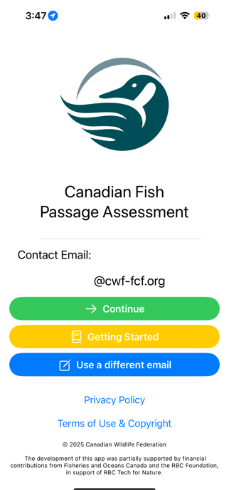
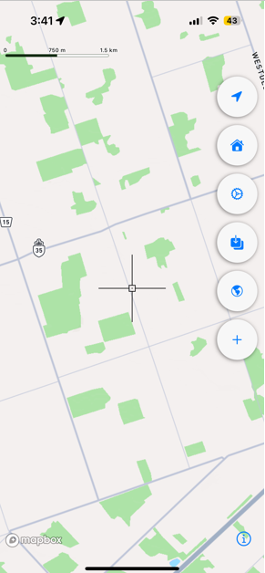
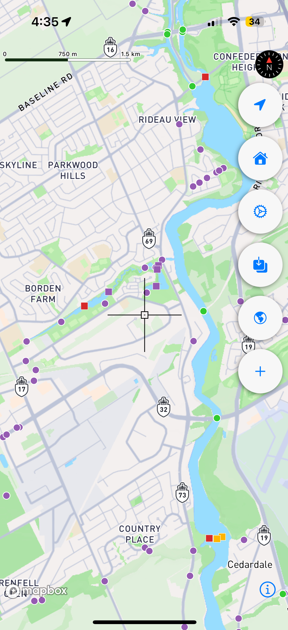
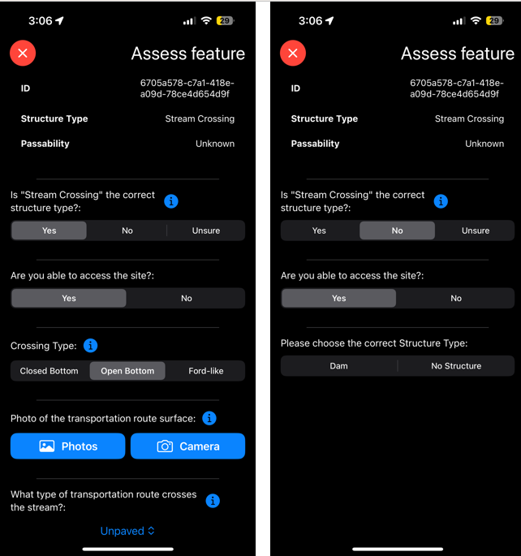
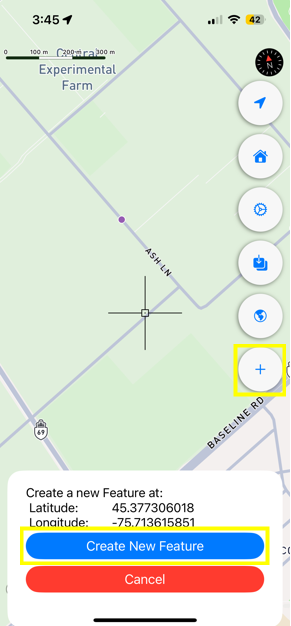
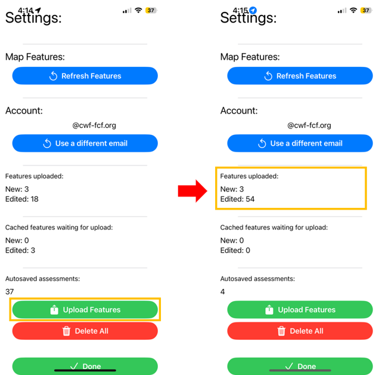

.. _ios-user-guide:

=============================
iOS User Guide
=============================

The CABD has compiled information on dams, waterfalls, stream crossings, and fishways from over 800 data sources; however, there is still many missing structures and a need to fill in information gaps for the majority of existing points. To address these data gaps, tools are being developed to enable individuals across the country to contribute information to the CABD. The CABD Rapid Barrier Assessment iOS mobile app is one such tool.

App Access and Installation
----------------------------
You can download the mobile app (Aquatic Barrier Ranger) from the Apple App store. Once installed, the app will be accessible on your phone with the CWF logo as the app icon. 

You are now ready to open and explore the app!

App Overview and Guidance
----------------------------
This page contains information on:

- :ref:`Getting Started on the App <getting-started>`
- :ref:`A summary of the user interface components <interface>`
- :ref:`Navigating the map space and barrier symbology <navigation>`
- :ref:`Assessing barrier features <assessing-barriers>`

.. _getting-started:

Getting Started
^^^^^^^^^^^^^^^^

Once the app is downloaded and installed, you can open it from your device’s home screen. On first launch, the home screen will appear with the CWF logo and your email address. You can also choose to enter a different email if needed. After saving your email, tap ‘Continue’ to access the main app interface and map view. Links to a Getting Started guide, Privacy Policy, and Terms of Use & Copyright are also available on this screen.

.. _interface:

Interface Components
^^^^^^^^^^^^^^^^^^^^^^
Once you’ve passed the home screen, you’ll arrive at the main map interface. In the top-right corner, you’ll see five buttons/icons that give you access to key features of the app.

Here’s a quick summary of what each one does:

.. _my-location:

.. list-table:: Title
   :widths: 25 25 50
   :header-rows: 1

   * - Button icon
     - Button Name 
     - Button Functionality

   * - |logo|
     - My Location
     - Snaps the map space back to your current location. 

   * - |logo1|
     - Settings 
     - Opens the Settings tab, within which you can refresh map features and view/manage your cache of assessed features see :ref:`using the feature cache to upload saved assessment submissions for more information on the feature cache <feature-cache>`.
    
   * - |logo2|
     - Map Tile Download
     - This button is not yet active and will do nothing when clicked. 

   * - |logo3|
     - Imagery/Base Map Toggle
     - Toggles between satellite imagery and base map views.

   * - |logo4|
     - New feature
     - Adds a new barrier feature point that does not already exist on the map, see :ref:`adding and assessing a new barrier below for more information on adding new features <adding-assessing-new-barriers>`. 

.. _navigation:

Navigating the Map Space and Barrier Symbology
^^^^^^^^^^^^^^^^^^^^^^^^^^^^^^^^^^^^^^^^^^^^^^^

On the map space page, you should see your current location along with the default base map. If your location is not automatically displayed, ensure that your device’s location services are enabled and that the app has permission to access your location. Once permissions are confirmed, press the :ref:`My Location button <my-location>`. to find your current location on the map. 

Within the map space, you’ll also see aquatic barrier layers:

- Dams – represented by squares
- Stream Crossings – represented by circles

While there is currently no in-app legend, the color of each icon indicates the passability status:

- Green - Passable 
- Orange - Partial Barrier
- Red - Barrier
- Purple - Unknown 

Additionally, once you begin :ref:`assessing barriers <assessing-barriers>`, halos will appear around them to indicate their status: 

- Green - uploaded features
- Blue - autosaved features
- Yellow - saved features.

When barrier visibility is toggled on, dams will always remain visible on the map. However, to improve app performance, stream crossings will automatically be hidden when you zoom out beyond a certain level. As you zoom back in, they will reappear.

You can navigate the map space using standard iOS gestures:

- Tap and drag to pan around the map.
- Pinch to zoom in or out.

You’ll also notice a small black square at the center of the screen (see image below). This is the app cursor, which helps you select barrier points on the map. There are two ways to select a barrier:

#. Tap and drag the screen until the crosshair is targeted at the barrier point of interest.
#. Click on a barrier point of interest and the crosshair will automatically snap to that feature. 

Once the cursor is aligned with a barrier point, a information box will appear at the bottom of the screen. This box displays the barrier ID, structure type, and passability status, along with an ‘Assess this Feature’ button.

Tapping the ‘Assess this Feature’ button opens a form that allows you to assess the selected feature. For detailed instructions on completing an assessment, see the next section :ref:`Assessing Barriers <assessing-barriers>`.

.. _assessing-barriers:

Assessing Barriers
^^^^^^^^^^^^^^^^^^^

All dams and stream crossings displayed in the map space are sourced from the Canadian Aquatic Barriers Database (CABD). With this app, you can either:

- Assess an existing barrier, or
- Create a new barrier feature that does not yet exist in the CABD.

To begin, align the app cursor with an existing barrier point, or move it to the location where you'd like to add a new barrier.

**Assessing Existing Barriers**

Once the cursor is aligned with an existing barrier point, an information box will appear at the bottom of the screen. This box displays the barrier ID, structure type, and passability status, along with an ‘Assess this Feature’ button (see image below).

To assess the selected barrier, tap the ‘Assess this Feature’ button. This will open the rapid assessment form. You can also exit the assessment form at anytime by clicking the "X" at the top left of the assessment form. 

The first question you will be asked is whether the structure type that exists in the CABD matches what you see at the site. For example, if the barrier feature is a stream crossing in the database, the question will read " is the structure type correct: Stream Crossing".

Then, there will be one of the two outcomes: 

- If the  structure type you see at the site is a stream crossing, you would select "Yes".
- If there is no stream crossing, but there is a dam or possibly no structure at all, you would select "No". If you select "No", you can then choose the correct structure type, include identifying that there is no structure at or nearby the location on the map. 

Once the structure type is confirmed, a set of assessment questions and photo prompts specific to that structure type will appear.

If you selected ‘Stream Crossing’ as the structure type, you’ll also be asked to choose a crossing sub-type:

- Closed-bottom
- Open-bottom
- Ford-like

Each sub-type includes a unique set of questions, so be sure to select the correct option.

.. _adding-assessing-new-barriers:

**Adding and Assessing a New Barrier**

If you encounter a dam or stream crossing that is not shown on the map (i.e., not already in the CABD), you can add a new feature and complete an assessment for it.

To add a new feature:

#. If you are standing at the structure, tap the GPS/Location button to snap the crosshair to your current location. Or, drag the map until the crosshair is positioned at the correct spot where the structure is located. 
#. Once the crosshair is in the correct spot, tap the :ref:`New Feature button <my-location>` (top-right corner of the screen) and a box will appear at the bottom of the screen with a blue "Create New Feature" button. 
#. Tap "Create New Feature" to open the rapid assessment form and begin entering information about the structure. 

The first step is to select the structure type:

- Stream Crossing
- Dam

Once you select the structure type, a customized set of assessment questions and photo prompts will appear based on your selection. If you are unable to take a photo at a particular feature, you can select 'no photo'.

If you choose ‘Stream Crossing’, you’ll also need to specify the crossing sub-type:

- Closed-bottom
- Open-bottom
- Ford-like

Each sub-type has a unique set of questions, so please be sure to select the correct one.

Once a new barrier assessment has been saved or uploaded, a black feature point will appear on the map at the assessment location — a square for dams and a circle for stream crossings. See :ref:`Saving and Uploading Barrier Assessment Submissions below for more information <saving-uploading-assessments>`. 

**Notes of Completing the Barrier Assessment Forms**

Each question in the assessment form includes an information icon next to it. Tapping this icon will open a tooltip containing helpful guidance and examples. These tooltips provide context, definitions, and instructions to help you accurately answer each question or take the required photos.

.. _saving-uploading-assessments:

**Saving and Uploading Barrier Assessment Submissions**

Once you’ve completed all the questions in the assessment form, you’re ready to save or upload your assessment. At the bottom of the form, you’ll see four buttons: 'Save for Later', 'Upload' 'Delete' and 'Cancel'. 

The ‘Cancel’ button allows you to exit the assessment form. The "Cancel" button will only appear after you have answered the first two questions in the form. Once these questions have been answered, the remaining assessment questions will appear, along with the "Cancel" button of the screen. If you choose to cancel the assessment at this stage, the assessment will be autosaved. 

The 'Delete' button allows you to delete the entire assessment form. You can only do this for features that have not yet been uploaded. 

The "Save for Later" button allows you to save the information you've entered into the assessment form so you can return to it and manually upload it later. this button does not upload the information to the central database. Once an assessment is saved, the associated feature point will appear on the map with a yellow halo around it, indicating that it has been stored locally. You can reopen the form for a saved feature at any time to continue editing or complete and upload it. The "Save for Later" function works whether you are connected to Wi-Fi, using cellular data, or even if you are offline with no service. 

.. figure:: img/ios_save.png
    :align: center
    :width: 30%

The ‘Upload’ button is used to submit your completed assessment directly to the database. You do not need to press ‘Save for Later’ before uploading—simply complete your assessment and click ‘Upload’ when you’re ready. Once an assessment is uploaded, the associated feature point will appear on the map with a green halo, indicating that it has been successfully submitted.

After an assessment is uploaded, you can still reopen the form to review the submitted information; however, the content can no longer be edited. The form becomes locked for editing after upload to ensure data integrity.

The appearance of the ‘Upload’ button changes based on your connectivity status. It will appear blue when connected to Wi-Fi, turquoise when using cellular data, and will be greyed-out when you have no service. You can only upload an assessment when connected to Wi-Fi or cellular data—uploading is not possible while offline. However, the app is fully designed to function offline. In situations where you do not have service, you should use the ‘Save for Later’ option and upload your completed assessment(s) manually once you regain a Wi-Fi or cellular connection.

.. figure:: img/ios_upload.png
    :align: center
    :width: 30%

.. _feature-cache:    

**Using the Feature Cache to Upload Saved Assessment Submissions**

If you’ve uploaded an assessment directly from an individual feature’s assessment form, you’re all done — great job! However, if you have saved one or more assessments instead, you can either upload them individually or submit them all at once using the app’s feature cache. To upload individually, simply reopen the saved assessment form while connected to Wi-Fi or cellular data, and tap the ‘UPLOAD’ button.

To upload multiple saved assessments at once, use the feature cache. You can access this by opening the Settings window — just tap the gear icon located in the top right-hand corner of the app. In the Settings window, you’ll see a summary of the features you’ve already uploaded, as well as a list of cached features (i.e., saved assessments) that are still waiting to be uploaded. The app displays counts for both new features and edited ones (edited features are those that already existed in the database and have been updated). If there are one or more assessments in the “Cached Features waiting for upload” section, you can tap the ‘UPLOAD FEATURES’ button to submit all saved assessments at once. Once the upload is complete, the counts of cached features will reset to zero.

In the feature cache, you’ll also find a ‘DELETE ALL’ button. This function will remove all saved and uploaded assessment features from the map — including their yellow and green halos — and delete all saved assessment form data stored locally in the app. Importantly, this action does not delete any information from the database.

The ‘DELETE ALL’ button is intended to help clear the app’s memory if performance becomes sluggish due to a large number of saved or uploaded features. You should only use this button if you are experiencing app performance issues, and it is essential to ensure that all saved features have been uploaded from the feature cache before doing so to avoid losing any unsubmitted data.

This guide covered all key app functions: navigation, assessments, saving, uploading, and feature management. Use it as a reference to ensure consistent and efficient data collection during your fieldwork.