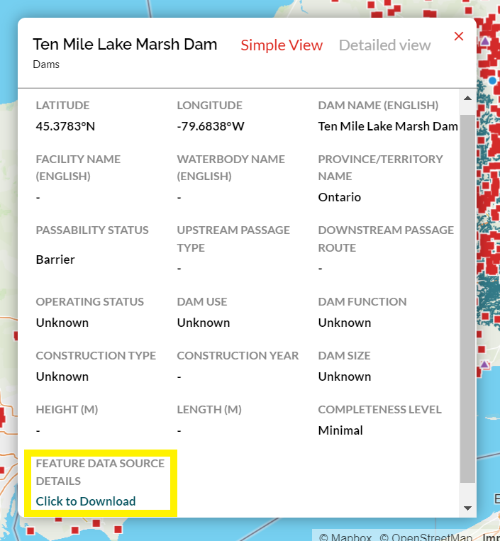

.. _data-source-details:

====================================
Feature Data Source Details Download
====================================

To account for the complex attribute mapping required to populate the CABD (i.e., various attributes for a single structure may come from different data sources), we have implemented a link under **Feature Data Source Details** in the attribute popup box (highlighted by the yellow box in the image below) that allows you to download a csv table with all the data source information available for a given data point. This can be accessed through the `web tool <https://aquaticbarriers.ca/>`_ or by making an API request to the :ref:`Feature Data Source End Point <feature-datasource-endpoint>`.

CSV Contents
------------

-----

The image below is an example of the data sources csv table. The numbered red boxes correspond with the descriptions listed below.

.. figure:: img/csv_download.png
    :align: center
    :width: 600

1. The name of the structure (if known).

2. The unique barrier/system identifier (``cabd_id``) for the structure.
	
3. The link to the `Data Sources <https://cabd-docs.netlify.app/docs_user/docs_user_data_sources.html>`_ page that holds the attribution information for the data held in the database.
    
   .. note:: 
       
       The shortened data source names in the CSV (shown is boxes 4, 6, and 8) can be cross referenced with the `Data Sources <https://cabd-docs.netlify.app/docs_user/docs_user_data_sources.html>`_ page to identify the full name and reference information for each data source.
	
4. The list of spatial data sources that contain a corresponding point for the structure.
	
5. The list of unique ids associated with the data source name listed in the same row of the table. This unique id corresponds with the feature in the listed data source and relevant attribute information for the structure was carried into the CABD.
	
6. The list of non-spatial data sources used to populate supplemental attribute information for the structure.
	
7. The list of attributes available in the CABD for the selected feature type.

8. The list of data sources representing which dataset was used to populate information for that specific attribute.

