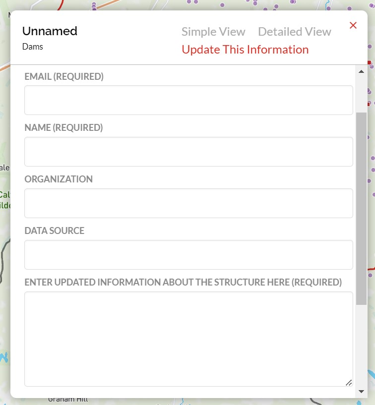

.. _submit-updates:

===================
Submit Data Updates
===================

We are working hard to fill existing data gaps in the CABD, but filling these data gaps is a huge job and we’re hoping people across Canada can help! We’re working on some new tools to allow users to submit information through the CABD web tool, but in the meantime you can submit updates to the attribute information for features in the CABD (i.e., a dam, waterfall, fishway or modelled crossing) by sharing the information with the CABD team via email (see below for details).

We’ll compile and release data updates in bulk periodically (every few months), so check out our :ref:`Data Releases <data-releases>` section for the latest updates!

Submitting Updates via the CABD Web Tool
----------------------------------------

-----

Updates to structures in the CABD can now be submitted directly through the CABD web tool `CABD web tool <https://aquaticbarriers.ca/en>`_. 

To submit information about a structure through the CABD web tool, locate the structure of interest on the map and click on it to open the attribute popup. From there, click on the ‘Update This Information' tab within the popup to open a form, which you can then fill out by providing the following information: 

- Your name (required), email (required), and organization (optional) - so that we can get in touch with you if we have any questions about your submission.
- A data source (optional) – this can just be your local knowledge, or if you have a website or other source you can provide it here.
- The information you’d like to update about the structure – this can be anything from the name of the structure, the height, whether it blocks fish passage, whether it is still in operation, or anything else you’d like to share.

You can also choose to be added to the CABD mailing list (where we will send out updates on new releases and other news) by clicking the ‘Add me to the CABD mailing list’ checkbox. After that, you will need to consent to CWF collecting your personal information (governed by the `CWF Privacy Policy <https://cwf-fcf.org/en/about-cwf/policies/privacy-policy.html>`_) and click ‘Submit’. Your information will be stored securely and won’t be shared with anyone beyond the CABD project team. The form will automatically be submitted to a database table where CWF staff will review the information, reach out if we have any questions, and then update the information in the database.

Submitting Updates via Email
----------------------------

-----

Updates to the CABD can also be sent to us via email at cabd@cwf-fcf.org.

.. important::
    
    To help us identify your submission as quickly as possible, please use the following as the email subject line: "CABD - User Submitted Updates".

The body of the email **must** include:

* The unique identifier (cabd_id) of the feature to be updated. This can be acquired through the web mapping tool by clicking on the point feature of the structure of interest, which will open the 'Attributes' popup window. Copy and paste the value provided for 'Barrier Identifier', or 'System Identifier' if the structure is a fishway.

* A URL link for the information source, if applicable. If the the information you are looking to provide comes from personal knowledge, that works too! We just ask that you include your name and organization (if applicable) in the email.

* A detailed explanation of the information to be updated.

Once received, our team will review the content and update the database with the provided information.

.. note::

    If you are interested in submitting more detailed updates to the CABD, please reach out to us at cabd@cwf-fcf.org

**Thank you for your contribution!**