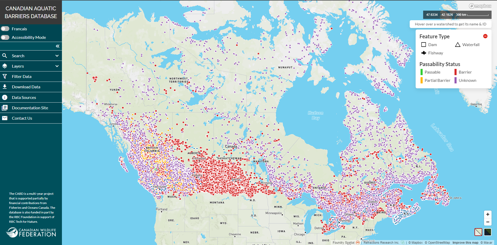

.. _web-tool:

=========================
The CABD Web Mapping Tool
=========================

.. toctree::
    :maxdepth: 3
    :hidden:

    docs_user_web_map/docs_user_web_map_tutorial_components
    docs_user_web_map/docs_user_web_map_tutorial_search
    docs_user_web_map/docs_user_web_map_tutorial_data_vis
    docs_user_web_map/docs_user_web_map_tutorial_attributes
    docs_user_web_map/docs_user_web_map_tutorial_filters
    docs_user_web_map/docs_user_web_map_tutorial_download
    docs_user_web_map/docs_user_web_map_tutorial_sources
    docs_user_web_map/docs_user_web_map_tutorial_docs
    docs_user_web_map/docs_user_web_map_tutorial_contact

The CABD web tool is a publicly accessible web map that allows users to easily explore, visualize and download data from the Canadian Aquatic Barriers Database (CABD).

You can access the CABD web tool by visiting https://aquaticbarriers.ca/.

.. _tutorials:

Explore the topics listed below to learn more about the different components and functionality that make up the web tool:

* :ref:`Interface Components <components>`
* :ref:`Searching <searching>`
* :ref:`Visualizing Data <visualizing>`
* :ref:`Viewing Attribute Information <attributes>`
* :ref:`Filtering Data <filtering>`
* :ref:`Downloading Data <downloading>`
* :ref:`Data Sources <data-sources>`
* :ref:`Documentation Site <docs>`
* :ref:`Contact Us <contact>`
