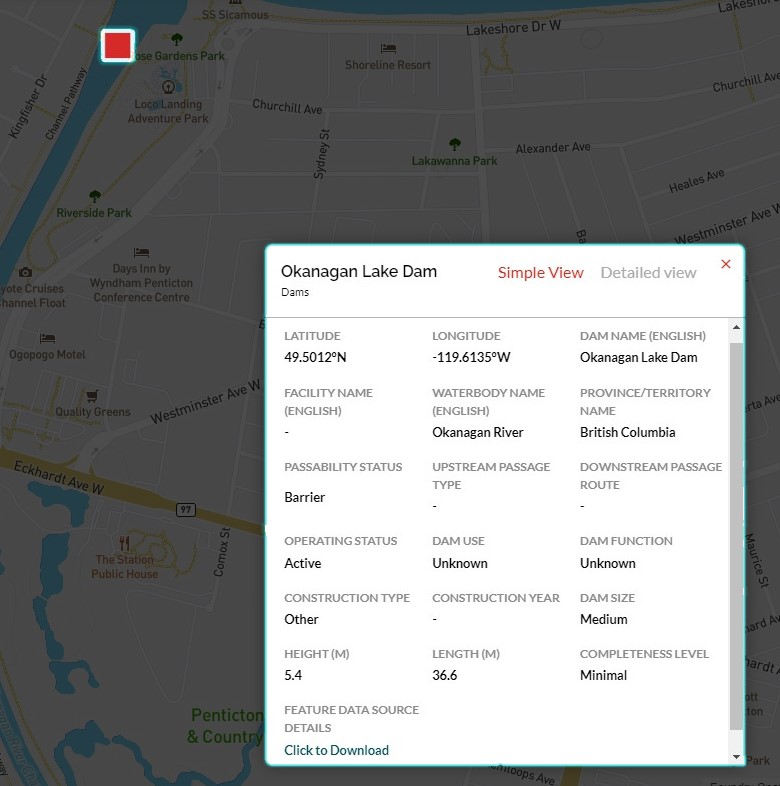
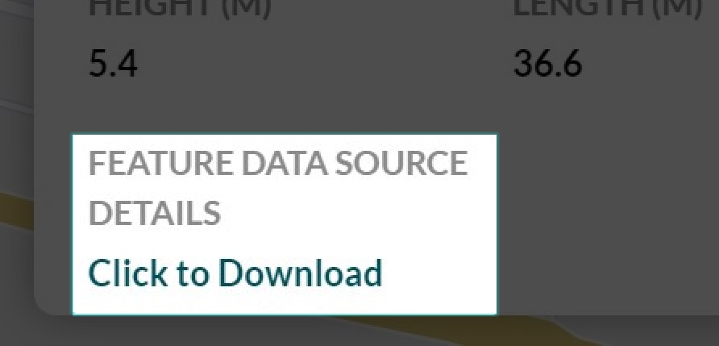

.. _attributes:

=============================
Viewing Attribute Information
=============================

To view the attribute information for a structure, simply click on its point in the map space and the ‘Attributes’ popup will appear.

The name of the structure can be found in the top left-hand corner of this window. Using the two buttons to the right of the structure name, you can toggle between the Simple View (a shortened list of key attributes) and the Detailed View (a list of all attributes available for the feature type). 

Down Data Source Information
----------------------------

At the bottom of both the Simple and Detailed Views is a link that you can click on to download a list of the data sources used to populate the structure’s attribute information. This information will download in CSV format. 

Please refer to the `'Feature Data Source Details Download <https://cabd-docs.netlify.app/docs_user/docs_user_data_sources/docs_user_data_sources_csv_download.html#csv-contents>`_ section on the CABD documentation site for more information about the CSV table contents.

