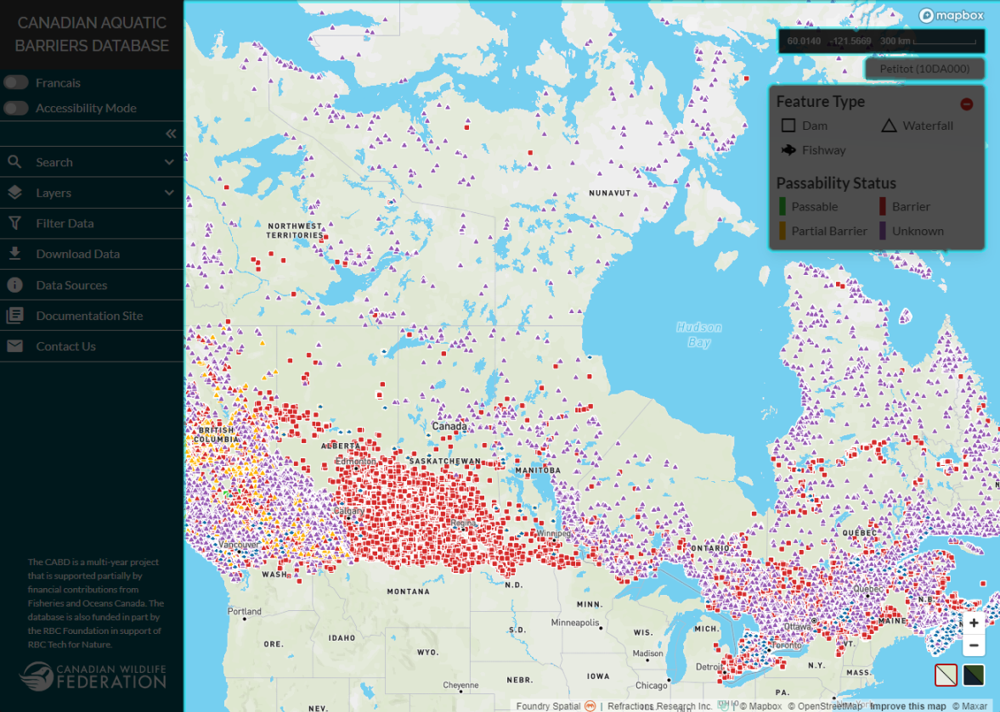
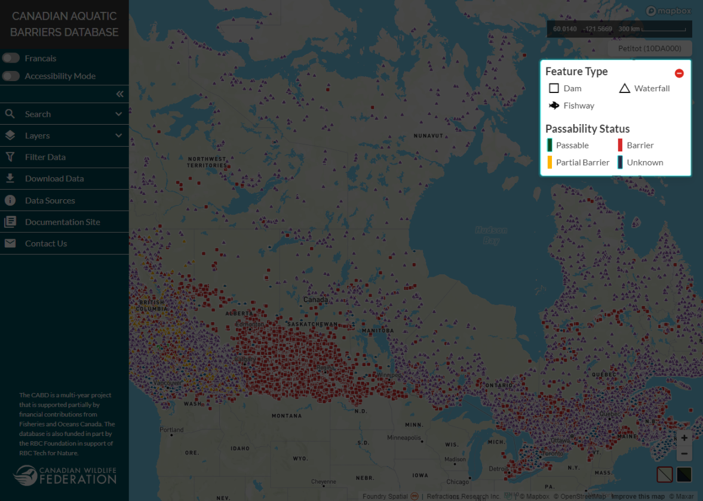
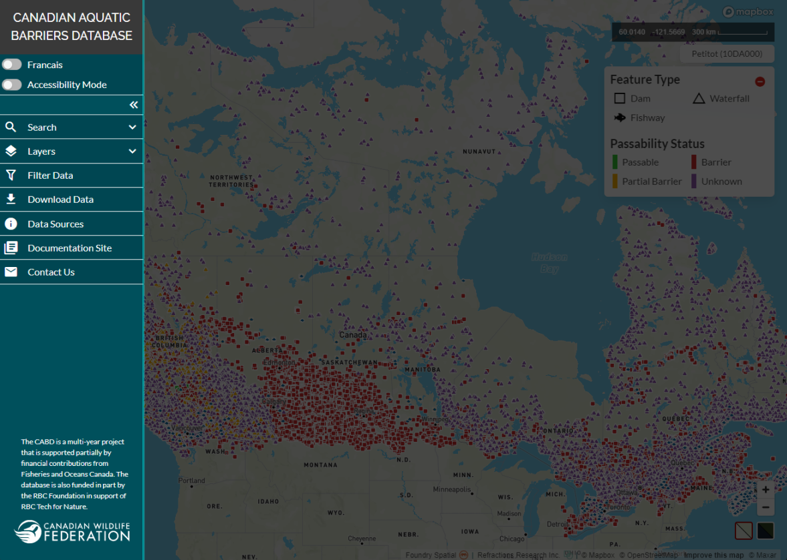

.. _components:

====================
Interface Components
====================

The user interface consists of 3 main elements:
#. the map view window
#. the legend
#. the lef-hand panel

The Map View Window
~~~~~~~~~~~~~~~~~~~

The map space is where data is visualized. 

You can zoom in or out of the map space in three different ways: using the scroll button on your mouse, dragging two fingers if using a track pad, or by clicking the ‘+’ or ‘-’ buttons located in the bottom right-hand corner of the map space.

Below the zoom buttons are two other buttons that allow you to toggle between the basemap (left) and satellite imagery (right).

The Legend
~~~~~~~~~~

A legend defines the symbology of the data. 

Here, the feature type (i.e., dam, waterfall, or fishway) that a data point represents is defined using shape while the passability status of the feature is defined using colour. If you have difficulty distinguishing colours from each other, you can visualize data using the ‘accessibility mode’. See the topic :ref:`‘Visualizing Data’ <visualizing>` for more details.

.. figure:: img/legend_highlight.png
    :align: left
    :width: 75%

To gain more space in the map view window, the legend window can be collapsed by clicking on the red circle in the top right corner of the legend window. To restore the legend window, simply click on the ‘Legend’ button. 

The Left-hand Panel
~~~~~~~~~~~~~~~~~~~

The left-hand panel is where you can access the bulk of the available web tool functionality.

This functionality includes:

* :ref:`Searching for a particular place or structure <searching>`
* :ref:`Visualizing the data in the map view <visualizing>`
* :ref:`Filtering the data based on a set of criteria <filtering>`
* :ref:`Downloading data <downloading>`

Other tabs in the panel will give you access to the :ref:`CABD documentation site <docs>` so you can explore the :ref:`data sources<data-sources>` used, review technical documentation, and more.
