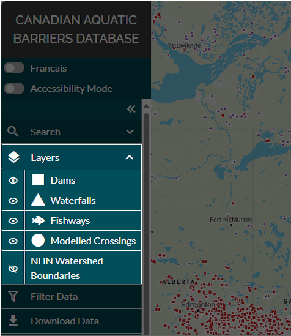
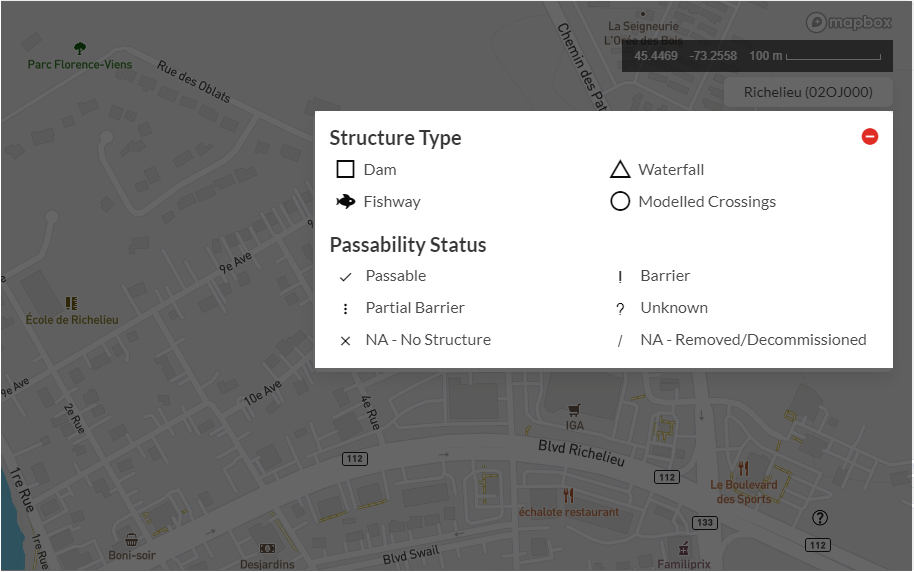

.. _visualizing:

================
Visualizing Data
================

When the web tool initially loads in your browser window, all feature layers (dams, waterfalls, and fishways) across Canada will be displayed by default, except for the NHN watershed boundaries layer which is toggled off. 

To change the visibility of data layers, navigate to the ‘Layers’ tab in the left-hand panel and click the eye icon.

Accessibility Mode
------------------

At the bottom of the layers panel is a toggle button called ‘Accessibility Mode’. When toggled on, the colour symbology used to define the passability status of a structure is changed to character symbols. This mode may be helpful if you have difficulty discerning colours.

