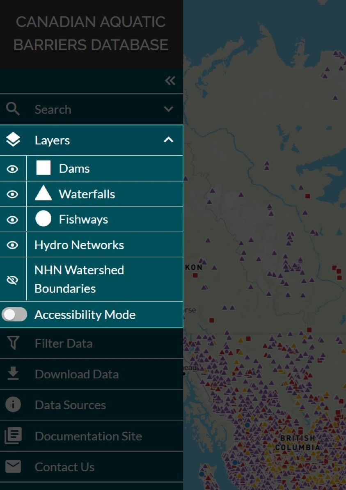
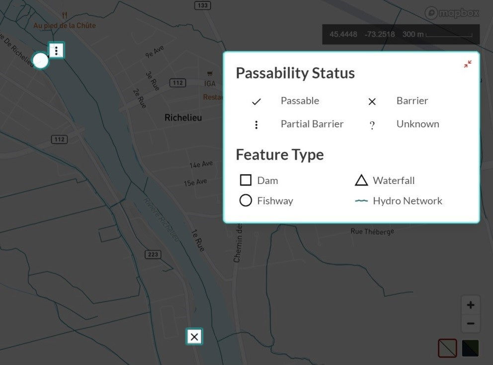

.. _visualizing:

================
Visualizing Data
================

When the web tool initially loads in your browser window, all feature layers (dams, waterfalls, fishways, and modelled crossings) across Canada will be displayed by default, except for the NHN watershed boundaries layer which is toggled off. 

To change the visibility of data layers, navigate to the ‘Layers’ tab in the left-hand panel and click the eye icon.

Please watch the video below for a demonstration on how to toggle the visibility of the layers in the left-hand panel.

.. raw:: html

    <video controls width="600"><source src="../../_static/Visualizing_data.mp4"></video>

Accessibility Mode
------------------

At the bottom of the layers panel is a toggle button called ‘Accessibility Mode’. When toggled on, the colour symbology used to define the passability status of a structure is changed to character symbols. This mode may be helpful if you have difficulty discerning colours.

Please watch the video below for a demonstration of how to activate accessibility mode in the CABD web tool.

.. raw:: html

    <video controls width="600"><source src="../../_static/Accessibility.mp4"></video>