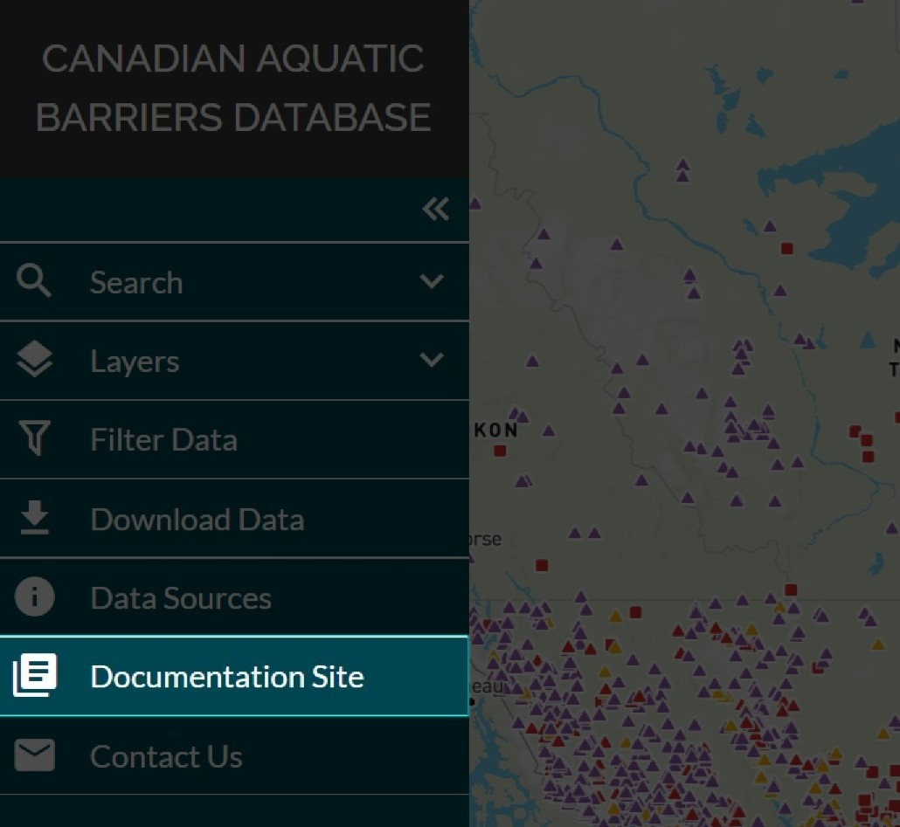

.. _docs:

==================
Documentation Site
==================
 
You can access the CABD documentation site by clicking the ‘Documentation Site’ tab in the left-hand panel. 

The CABD documentation site contains a number of user resources and technical documentation that provide more information about the CABD web tool, the data held in the CABD, and the database architecture.