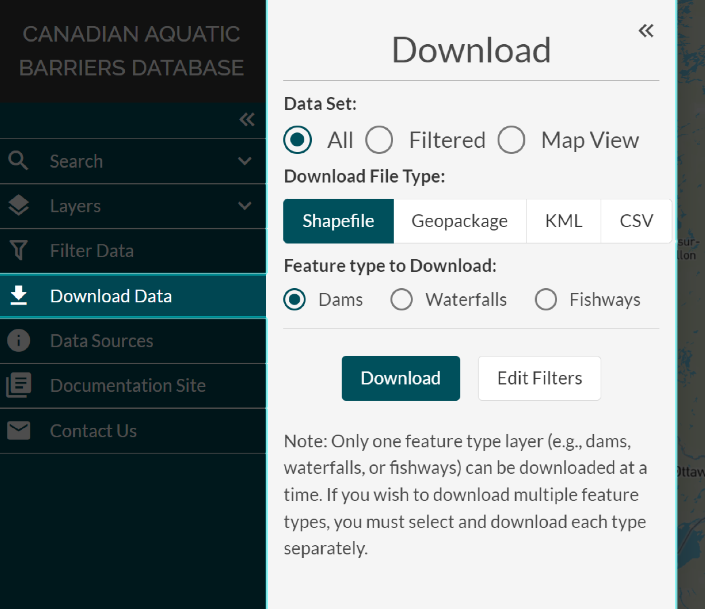

.. _downloading:

================
Downloading Data
================

Data can be downloaded by opening the ‘Download’ window. This window can be opened by clicking the ‘Download Data’ button in the ‘Filters’ window, or by navigating to the ‘Download Data’ tab in the left-hand panel.

There are three data set options you can choose from when downloading data:

1. Download your filtered results
2. Download the data currently displayed in your map view window (this is the set of filtered points which show up on the current map view)
3. Download all the available data for one layer at a time

Once you’ve chosen your desired data set type, you can select file type you’d like to receive the data as by clicking on either the ‘Shapefile’, ‘Geopackage’, ‘KML’, or ‘CSV’ button. 

When downloading all data, you will need to select which feature type layer you would like that data for. If you’d like to download all data for more than one layer, you will need to download each layer separately.

During this process, you can navigate the map view while the download window is open. If the filters applied to data need to be edited, you can press the ‘Edit Filters’ button in the bottom right to reopen the ‘Filter Data’ window.

Please watch the video below for a demonstration on how to download data through the CABD web tool.

.. video:: vid/Downloading_data.mp4
    :width: 600