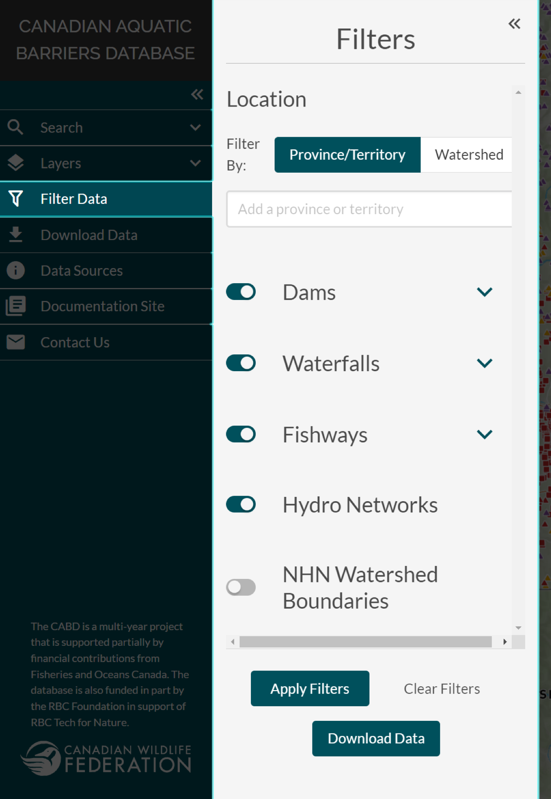
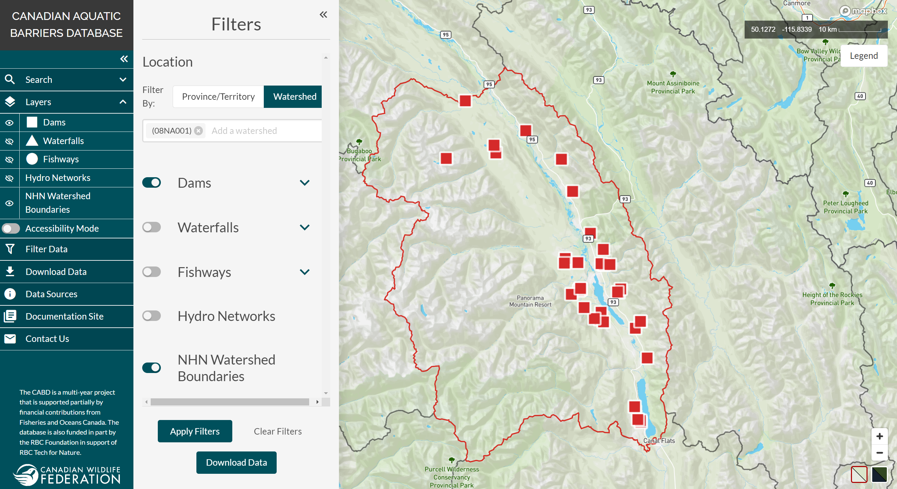
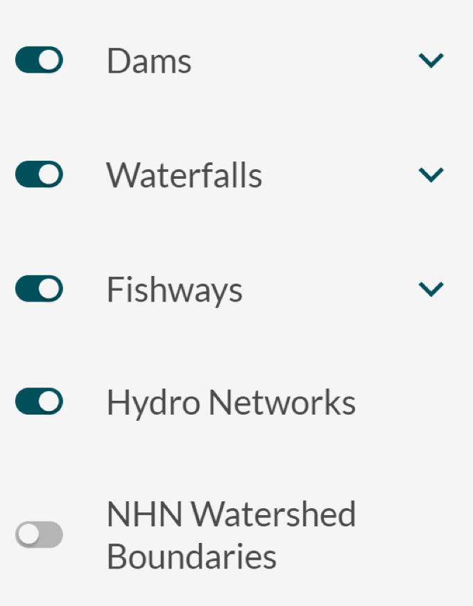

.. _filtering:

==============
Filtering Data
==============

To filter data based on a specific set of criteria, you will need to open the ‘Filters’ window by clicking the ‘Filter Data’ tab in the left-hand panel. 

Filter by Location
------------------

Depending on your area of interest, data can be filtered by province/territory or by watershed. 

To add the area you are interested in to the filter, simply select it from the drop-down list, or begin typing the name into the text box. The drop-down list will be filtered based on the partial or full name of a province/territory or watershed entered in the text box. Click on a name to add it to the criteria to be filtered on.

Each new selection is added to the text box to create a list of criteria to filter on. If a previously selected area needs to be removed from the list, click the ‘x’ on the right-hand side of the entry. 

In addition to using the method above, watersheds can be added to the filter by clicking in the map view.

To do this, you will need to toggle on the ‘NHN Watershed Boundaries’ layer located in the ‘Layers’ tab of the left-hand panel. Zoom to your desired location and click on the watershed that encompasses your area of interest. When clicked, the boundary of the watershed will change to red and the name will be added to the filter text box. To remove a selected watershed from the textbox list, click the ‘x’ next to it, as mentioned above, or click on the watershed in the map view a second time to deselect it.

.. note::
    
    Data can only be filtered by province/territory or watershed at one time. Selections may be made under both options but only the criteria present in the active window will be used for filtering the data. 

Please watch the videos below for a demonstration on how to filter by province/territory or watershed.

.. video:: vid/Filter_by_location.mp4
    :width: 600

Filtering by province/territory

.. video:: vid/Filter_by_Watershed.mp4
    :width: 600

Filtering by watershed

Filter by Attribute
-------------------

Below the options to filter by location are the options to filter each feature type by a predefined list of attributes. 

To exclude an entire feature type from being filtered, you can toggle it off by clicking the toggle switch on the left inside the ‘Filters’ window.

    Here, filters have been applied to only show data for dams.

To view the filterable attributes for a specific feature type, expand the section and select criteria from the available options. The checkbox to the right of each attribute name can be used to reset or clear all checkboxes for the values listed below it. If an attribute value is checked, all features that contain this value in the database will appear in the map view window once the ‘Apply Filters’ button is clicked. If an attribute value is unchecked, all features that contain that value will be omitted from the results and not displayed in the map view window. 

Please watch the video below for a demonstration on how to filter by attribute.

.. video:: vid/Filter_by_attribute.mp4
    :width: 600

Apply Filters, Clear Filters and Download Data Buttons
------------------------------------------------------

The ‘Apply Filters’ button must be clicked to apply filters and display the filter results in the map view. If you choose to edit your selection after filters have already been applied, you can do so, but will need to click the ‘Apply Filters’ button again for the change to register. 

To clear all selected filters and reset the ‘Filters’ window back to default, click the ‘Clear Filters’ button. This action cannot be undone.

Once data is filtered, you can download the results by clicking on the ‘Download Data’ button, which will open the ‘Download Data’ window (see topic :ref:`Downloading Data <downloading>` for more details).