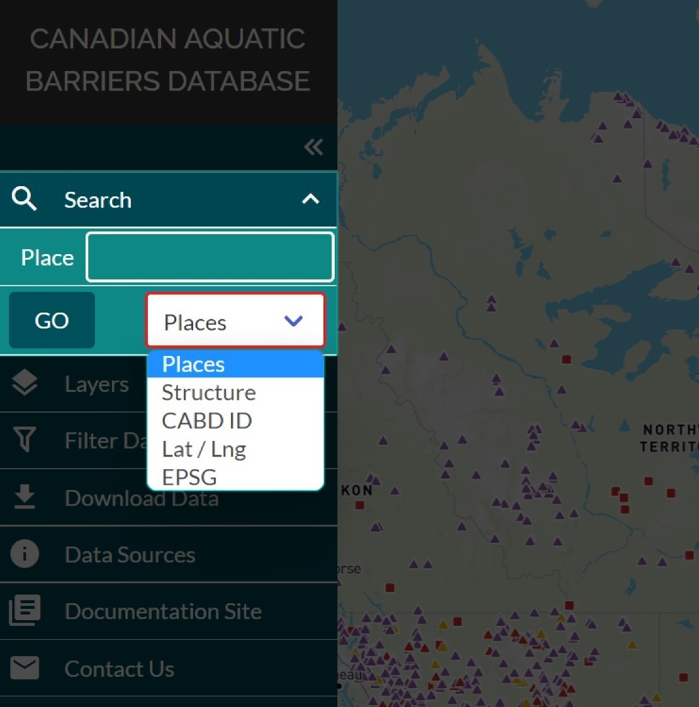

.. _searching:

=========
Searching
=========

The ‘Search’ tab is the first tab in the left-hand panel.

You can choose to search for a location or structure in a few different ways :

1. **Places:** find a geographic location using a place name

    .. figure:: img/place_search.png
        :align: left
        :width: 40%

2. **Structure:** find a structure using the dam/structure name

    .. figure:: img/structure_search.png
        :align: left
        :width: 40%

3. **CABD ID:** find a structure using the CABD ID (i.e., barrier identifier/system identifier seen in the ‘Attributes’ popup window)

    .. figure:: img/cabd_search.png
        :align: left
        :width: 40%

4. **Lat/Lng:** find a specific geographic location using latitude and longitude values

    .. figure:: img/lat_search.png
        :align: left
        :width: 40%

5. **EPSG:** find a geographic location using the x- and y-coordinates that correspond to a specific EPSG code.

    .. figure:: img/epsg_search.png
        :align: left
        :width: 40%

Please watch the video below for a demonstration on how to user the search functionality to find a specific geographic location.

.. video:: vid/Search.mp4
    :width: 600