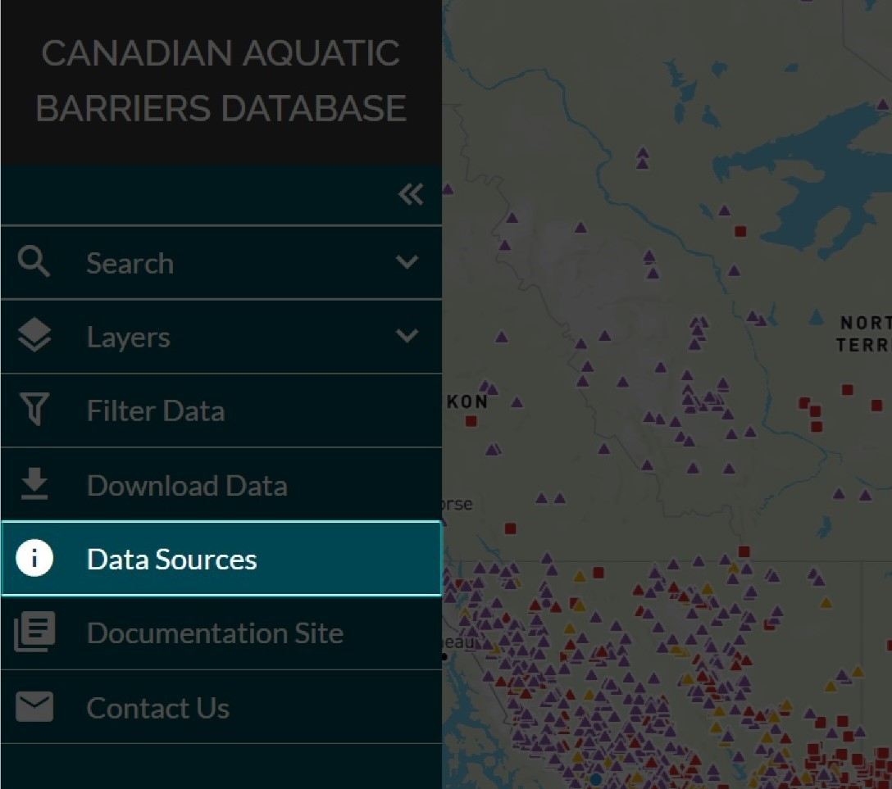

.. _sources:

============
Data Sources
============

Data source information for all spatial and non-spatial sources can be accessed by navigating to the ‘Data Sources’ tab in the left-hand panel. When clicked, the ‘Data Sources’ page on the CABD documentation site will open in a new browser tab. 

There is a table on the ‘Data Sources’ page that you can search using the search box at the top right of the table. The ‘Data Source Short Name’ field contains hyperlinked values that will you to more detailed information about the data source when clicked.

.. figure:: img/data_sources_page_highlight.png
    :align: left
    :width: 90%

The data source short names in this table can be cross-referenced with the values provided in the ‘datasource_name’ columns in the ‘Feature Data Source Download’ CSV. `Click here for more details. <https://cabd-docs-fr.netlify.app/docs_user/docs_user_data_sources/docs_user_data_sources_csv_download.html#csv-contents>`_

Please watch the video below for a demonstration on how to access the Data Sources page and search table on the CABD Documentation Site.

.. raw:: html

    <video controls width="600"><source src="../../_static/Data_sources.mp4"></video>