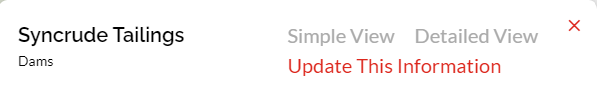
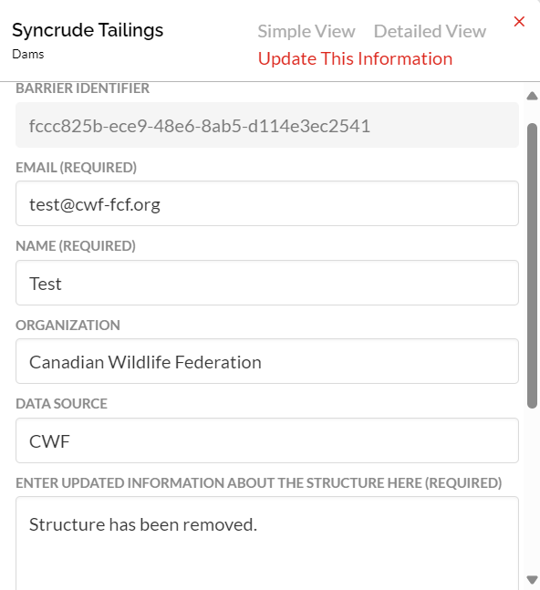
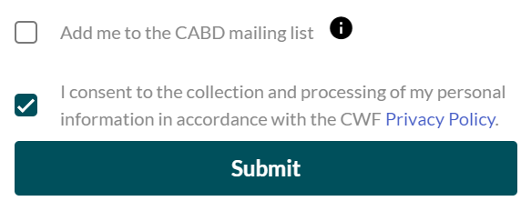
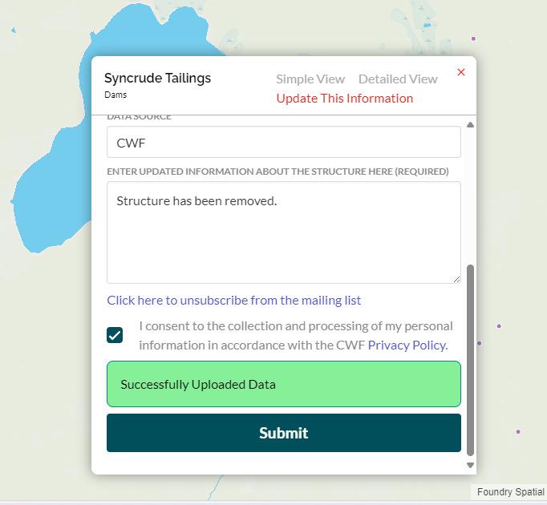

.. _data-submissions:

=======================
Submitting Data Updates
=======================

To update information for a specific structure, simply click on its location in the map. An Attributes popup will appear, allowing you to easily update the information under the "Update This Information" section.

When updating information, some fields are required and others are optional:

1. Barrier Identifier (automatically entered)
2. Email (required)
3. Name (required)
4. Organization (optional)
5. Data Source (optional)
6. Enter Updated Information about the Structure Here (required)

At the bottom of the page, you can opt to join the CABD mailing list to receive the latest news and data releases directly in your inbox. Just a reminder: you'll need to agree to the collection and processing of your personal information as stated in the `CWF Privacy Policy. <https://cwf-fcf.org/en/about-cwf/policies/privacy-policy.html>`_

The video below shows you how to update information about a specific structure using the web tool.

.. raw:: html

    <video controls width="500"><source src="../../_static/submit_data_update.mp4"></video>

Once subscribed to the mailing list, you can unsubscribe by clicking the button as shown below.

This information, and more on how to submit data updates via email, is available on the :ref:`Submit Data Updates <submit-updates>` page of the CABD User Resources section.